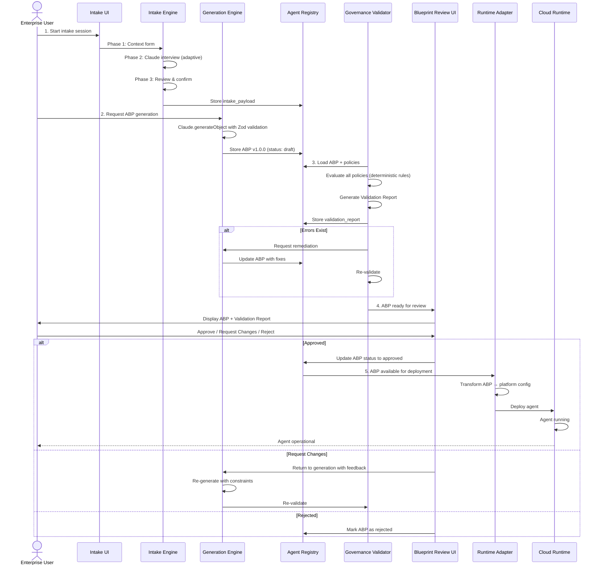

# Architecture Overview

> **TL;DR:** Intellios is organized into two major subsystems: the Design Studio (where agents are created and designed) and the Control Plane (where governance, validation, and lifecycle management occur). Agents flow through this pipeline as Agent Blueprint Packages—immutable, versioned artifacts that serve as the single source of truth. Execution is delegated to cloud runtimes via runtime adapters, keeping the platform deployment-agnostic.

## Overview

Intellios is structured as a **pipeline system** with two major subsystems operating on a single central artifact: the **Agent Blueprint Package (ABP)**. This structure decouples agent *design* (which happens interactively with enterprises) from agent *governance* (which happens deterministically against policies) and from agent *execution* (which happens in cloud runtimes outside Intellios's scope).

The separation of concerns is intentional:

- **Design Studio** — Captures requirements and generates candidates. The focus is creativity, flexibility, and rapid iteration with the enterprise.
- **Control Plane** — Validates, gates, and governs. The focus is policy compliance, auditability, and risk management.
- **Runtime Execution** — Delegated to cloud providers. The focus is performance, isolation, and operational resilience.

This three-part architecture enables Intellios to remain focused on its core value: governance-driven agent design and lifecycle management, while remaining agnostic to execution platforms.

## How It Works

### High-Level System Diagram

```
┌─────────────────────────────────────────────────────┐
│                    DESIGN STUDIO                    │
│                                                     │
│  ┌────────────────┐         ┌──────────────────┐   │
│  │ Intake Engine  │────────▶│ Generation Engine │   │
│  │                │         │   (produces ABP)  │   │
│  └────────────────┘         └────────┬──────────┘   │
│                                      │              │
│                                      ▼              │
│                              ┌──────────────┐       │
│                              │ Blueprint    │       │
│                              │ Studio (UI)  │       │
│                              └──────┬───────┘       │
└─────────────────────────────────────┼───────────────┘
                                      │
                                      ▼
┌─────────────────────────────────────────────────────┐
│                   CONTROL PLANE                     │
│                                                     │
│  ┌──────────────────┐        ┌──────────────────┐  │
│  │  Governance      │        │  Agent Registry  │  │
│  │  Validator       │        │  (PostgreSQL)    │  │
│  │  (Policy Engine) │        │                  │  │
│  └────────┬─────────┘        └────────┬─────────┘  │
│           │                           │            │
│           └───────────┬────────────────┘            │
│                       ▼                            │
│            ┌──────────────────────┐                │
│            │ Blueprint Review UI  │                │
│            │ (Human Approval)     │                │
│            └──────────┬───────────┘                │
└─────────────────────────┼────────────────────────────┘
                          │
                          ▼
             ┌────────────────────────┐
             │  RUNTIME ADAPTERS      │
             │                        │
             │  • AWS AgentCore       │
             │  • Azure AI Foundry    │
             │  • On-Premise (Future) │
             └────────────┬───────────┘
                          │
                          ▼
             ┌────────────────────────┐
             │  CLOUD RUNTIMES        │
             │  (Agent Execution)     │
             └────────────────────────┘
```

### Full Data Flow

The journey of an agent from conception to execution follows this sequence:

**1. Intake Phase** — An enterprise user describes the agent they want to build. The **Intake Engine** captures this through a three-phase structured process:
   - **Phase 1 — Context Form:** Deployment type (internal, customer-facing, partner-facing), data sensitivity, applicable regulations, and key integrations.
   - **Phase 2 — Conversational Intake:** Claude engages in adaptive conversation, probing for governance context. The system selects Claude Sonnet for complex reasoning (multi-turn logic, constraint synthesis) and Claude Haiku for simple clarifications, optimizing for cost and latency.
   - **Phase 3 — Review:** The user confirms the captured requirements before generation proceeds.

   The Intake Engine supports **7 parallel stakeholder input lanes**: compliance, risk, legal, security, IT, operations, and business. Enterprises can invite stakeholders to contribute directly, and the engine synthesizes their input. It also provides **express-lane templates** for common patterns (e.g., "Customer Service Bot," "Internal Research Assistant") to accelerate intake for standard use cases.

   Output: Structured `intake_payload` stored in the database.

**2. Generation Phase** — The **Generation Engine** consumes the intake payload and produces an **Agent Blueprint Package (ABP)** using Claude's `generateObject` method with Zod schema validation. The Generation Engine:
   - Crafts a deterministic system prompt that translates intake requirements into ABP structure.
   - Calls Claude to generate the ABP as validated JSON (Zod ensures schema compliance).
   - Stores the ABP in the Agent Registry (PostgreSQL).
   - Supports **iterative refinement**: enterprises can request natural language changes ("Make the agent more cautious about modifying data") and the Generation Engine re-runs generation with the updated constraints.

   Output: ABP version 1.0.0, stored in agent_blueprints table with status `draft`.

**3. Governance Validation Phase** — The **Governance Validator** automatically evaluates the ABP against the enterprise's governance policies. The validator:
   - Loads all active policies from the policy registry (PostgreSQL).
   - Evaluates each policy using a **deterministic rule expression language** with 11 operators: `exists`, `not_exists`, `equals`, `not_equals`, `contains`, `not_contains`, `matches`, `count_gte`, `count_lte`, `includes_type`, `not_includes_type`. No machine learning, no probabilistic outcomes.
   - Generates a **Validation Report** containing: `valid` (bool), `violations` (list), `policyCount` (int), `generatedAt` (timestamp).
   - If violations exist, Claude is called to generate **remediation suggestions** for each violation (e.g., "Add data minimization rules to the capabilities block").
   - The ABP cannot progress to human review if any error-severity violations exist.

   Output: Validation Report stored in agent_blueprints.validation_report (JSONB).

**4. Human Review Phase** — The **Blueprint Review UI** presents the ABP to designated reviewers. Reviewers:
   - See the ABP in a structured form (identity, capabilities, constraints, governance, ownership).
   - See the Validation Report (violations, if any, and remediation suggestions).
   - Approve, request changes, or reject the ABP.
   - Optionally add comments and approval signatures.

   Output: ABP status transitions from `draft` to `in_review` to `approved` (or `rejected`, or back to `draft` if changes are requested). The approval chain is recorded in the ABP's ownership block.

**5. Versioning & Storage Phase** — Approved ABPs are immediately available for deployment. The Agent Registry:
   - Stores each ABP version as an immutable row.
   - Maintains semantic versioning: patch (bug fixes), minor (non-breaking additions), major (breaking changes).
   - Tracks status transitions: draft → in_review → approved → deployed → deprecated.
   - Provides APIs for lookup, search (by tag, owner, status), and version history.

   Output: ABP available for deployment as agent_blueprints.id + version.

**6. Deployment Phase** — Runtime Adapters consume approved ABPs and translate them into platform-specific configurations:
   - **AWS AgentCore Adapter** — Transforms ABP into CloudFormation templates, Lambda configurations, IAM policies, API Gateway endpoints, CloudWatch logging rules (respecting the audit policies in the ABP).
   - **Azure AI Foundry Adapter** — Transforms ABP into ARM templates and Azure AI Foundry project configurations.

   Output: Agent running in the chosen cloud runtime, configured exactly as the ABP specifies.

> **[DIAGRAM: Agent Creation Sequence — detailed swimlane diagram showing all phases and data transitions]**
>
> *Dimensions: 1400x800 | Format: SVG preferred, PNG fallback*
> *Source file: `_assets/agent-creation-sequence.svg`*

### Data Flow Sequence Diagram



## Subsystem Details

### Design Studio

The Design Studio is responsible for **creating** agents. It comprises two components:

**Intake Engine**
- Captures enterprise requirements through a three-phase guided process.
- Supports 7 parallel stakeholder input lanes (compliance, risk, legal, security, IT, operations, business).
- Provides express-lane templates for common patterns, reducing intake time for standard use cases.
- Conducts adaptive conversational intake using Claude, with intelligent model selection: Claude Sonnet for complex multi-turn reasoning, Claude Haiku for simple clarifications.
- Stores progressive intake state in the database, allowing sessions to pause and resume.
- Output: Structured `intake_payload` object.

**Generation Engine**
- Consumes intake payloads and produces Agent Blueprint Packages.
- Uses Claude's `generateObject` with Zod schema validation to ensure output conforms to ABP schema.
- Supports iterative refinement: enterprises can request changes in natural language, and the engine re-generates with updated constraints.
- Fully deterministic: given the same input and model version, produces the same output.
- Output: ABP stored in Agent Registry with status `draft`.

**Blueprint Studio (UI)**
- A preview and refinement interface where designers see the generated ABP before submitting for review.
- Allows designers to edit ABP fields directly (identity, capabilities, constraints, governance settings).
- Triggers re-validation if changes are made, showing updated Validation Reports in real-time.
- Provides a clear "Submit for Review" action that transitions the ABP to `in_review` status.

### Control Plane

The Control Plane is responsible for **governing** agents. It comprises three components:

**Governance Validator**
- Automatically evaluates ABPs against enterprise governance policies.
- Uses a deterministic rule expression language (11 operators, no LLM involved in evaluation itself).
- Generates Validation Reports with violations, severity levels (error, warning), field paths, and remediation suggestions.
- Violations include Claude-generated suggestions for how to remediate the issue.
- Prevents ABPs with error-severity violations from advancing to human review.
- Fully auditable: every policy evaluation can be traced and explained.

**Agent Registry**
- Central PostgreSQL-backed repository for all ABPs in the enterprise.
- Stores ABPs as immutable versions (semantic versioning).
- Tracks status transitions through the lifecycle: draft → in_review → approved → deployed → deprecated.
- Provides APIs for lookup (by ID, version), search (by tag, owner, status, date range), and version history.
- Returns ABPs with full provenance: creation timestamp, creator, approval chain, deployment record.
- Enables compliance queries: "Show me all agents in production approved by Compliance Officer Carol."

**Blueprint Review UI**
- Human interface for reviewing generated ABPs before approval.
- Displays the ABP in a structured form (6 blocks: metadata, identity, capabilities, constraints, governance, ownership).
- Shows the Validation Report alongside the ABP.
- Provides approve/reject/request-changes workflow.
- Records reviewer identity, approval timestamp, and optional comments.
- Generates approval chain signatures stored in the ABP's governance block.

## Technology Foundation

### Platform Stack

| Layer | Technology | Purpose |
|-------|-----------|---------|
| **Web Framework** | Next.js 16 (App Router) | Server-side rendering, API routes, streaming responses |
| **AI Integration** | Vercel AI SDK v5 | Claude API integration, streaming, tool calling, structured generation |
| **Database** | PostgreSQL + Drizzle ORM | Schema management, migrations, type-safe queries |
| **UI Components** | Catalyst Kit (27 components) | Tailwind Labs component library, production-grade UI |
| **Styling** | Tailwind CSS | Utility-first CSS, responsive design |
| **LLM Provider** | Anthropic Claude (API) or Amazon Bedrock | Intake interviews, ABP generation, remediation suggestions |

### Key Design Decisions

**Artifact-Centric:** The ABP is the single source of truth. Every subsystem operates on ABPs. This ensures consistency and auditability.

**Deterministic Governance:** Policies use structured rule expressions (not LLM-based evaluation). This makes governance reproducible and auditable.

**Adaptive Model Selection:** The Intake Engine intelligently chooses Claude Sonnet (for complex reasoning) or Haiku (for simple clarifications), optimizing latency and cost.

**Runtime Agnostic:** The ABP is platform-neutral. Runtime Adapters handle platform-specific deployment details. This enables multi-cloud deployments without governance complexity.

**Immutable Versioning:** Once an ABP version is released, it is immutable. All changes require new versions. This ensures audit trail completeness.

**Migrate-on-Read:** ABPs are versioned. When an older ABP is read, forward-compatible migrations are applied automatically. No in-place schema upgrades, no breaking changes.

## Relationship to Other Concepts

Understanding how subsystems connect is key to understanding Intellios:

- **[Agent Blueprint Package (ABP)](../03-core-concepts/agent-blueprint-package.md)** — The central artifact produced by the Design Studio and consumed by the Control Plane, Governance Validator, Agent Registry, and Runtime Adapters.

- **[Governance-as-Code](../03-core-concepts/governance-as-code.md)** — The policy expression language used by the Governance Validator to evaluate ABPs. Policies are deterministic, executable, and auditable.

- **[Design Studio](../03-core-concepts/design-studio.md)** — Deep dive into Intake Engine design, Generation Engine algorithms, and Blueprint Studio UX.

- **[Control Plane](../03-core-concepts/control-plane.md)** — Deep dive into Governance Validator logic, Agent Registry schema and APIs, and Blueprint Review UI workflows.

- **[Agent Lifecycle](../03-core-concepts/agent-lifecycle-states.md)** — The state machine governing ABP status transitions. Governance policies constrain which transitions are allowed.

- **[Compliance Evidence Chain](../03-core-concepts/compliance-evidence-chain.md)** — How Intellios generates compliance documentation (SR 11-7 model inventory, SOX audit trails, GDPR data processing records) from ABP metadata.

- **[Runtime Adapters](../04-architecture-integration/runtime-adapter-pattern.md)** — How platform-specific deployment is isolated from the governance platform. Adapters translate ABPs into AWS, Azure, or on-premise configurations.

## Key Principles

1. **Separation of Concerns** — Design, governance, and execution are independent subsystems. Designers focus on building agents; policy teams focus on governance; cloud teams focus on operational resilience. Each subsystem has clear inputs, outputs, and responsibilities.

2. **Single Source of Truth** — The ABP is the only artifact that flows through the system. No parallel documentation, no shadow configuration. When you change an agent, you change one artifact and all subsystems see the change.

3. **Deterministic Governance** — Governance policies are evaluated using structured logic, not machine learning. Every policy evaluation can be explained and reproduced. This is essential for regulated industries.

4. **Immutability & Auditability** — ABPs are versioned and immutable. Every change creates a new version. This ensures that any governance decision, deployment, or audit event can reference the exact ABP version involved.

5. **Platform Agnosticism** — The platform does not prescribe a specific deployment target. Runtime Adapters enable deployment to AWS, Azure, or on-premise runtimes. Enterprises can change deployment platforms without changing their agent designs or governance policies.

6. **Compliance-Native** — Compliance is not an afterthought. Governance policies are part of the core system. Compliance evidence is generated automatically from ABP metadata as agents flow through the pipeline.

## Summary

Intellios is a **two-subsystem pipeline** operating on a **single central artifact** (the ABP). The Design Studio creates agents; the Control Plane governs them; cloud runtimes execute them. This separation enables rapid, compliant agent deployment at enterprise scale.

The architecture prioritizes governance, auditability, and portability. By making the ABP the source of truth and governance evaluation deterministic, Intellios transforms agent deployment from a risky, compliance-heavy process into a streamlined, auditable pipeline.

---

*See also: [Agent Blueprint Package](../03-core-concepts/agent-blueprint-package.md), [Governance-as-Code](../03-core-concepts/governance-as-code.md), [Agent Lifecycle](../03-core-concepts/agent-lifecycle-states.md)*

*Next: [Design Studio Deep Dive](../03-core-concepts/design-studio.md), [Control Plane Deep Dive](../03-core-concepts/control-plane.md)*
