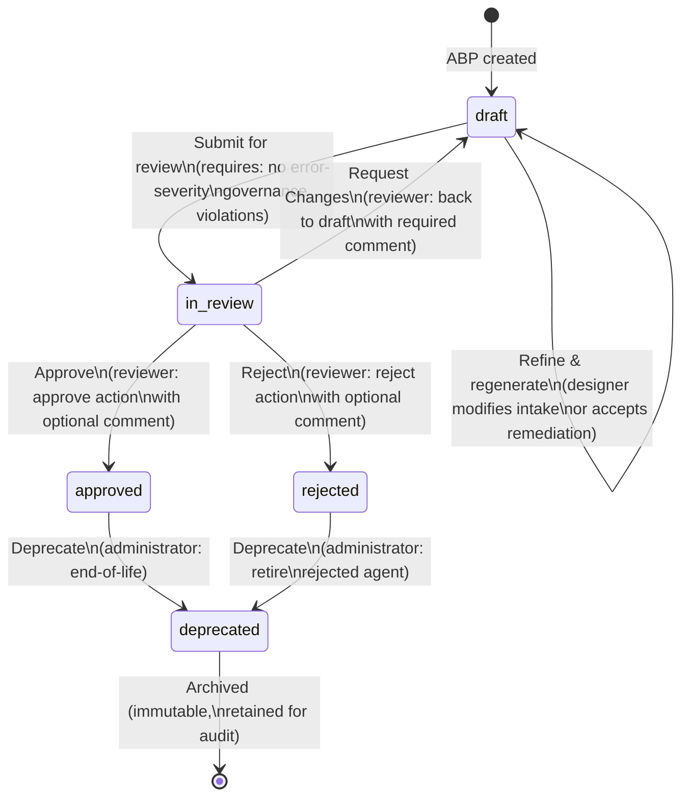

# Agent Lifecycle States

> **TL;DR:** Intellios manages agents through a five-state lifecycle: draft, in_review, approved, rejected, and deprecated. Agents cannot reach production without passing governance validation (error-severity violations block submission) and human review (mandatory approval with documented reasoning). No deletion exists—only deprecation. Every state transition is recorded in an immutable audit trail with timestamp, actor, and optional comment for full regulatory compliance and accountability.

## Overview

Enterprise governance requires not just *what* agents are deployed, but *who approved them*, *when*, *under what conditions*, and *why*. A single agent created on a Friday with no review can create compliance risk for a quarter. Regulators investigating a model failure need to see the entire approval chain. Auditors need to verify that governance policies were applied at decision time. Compliance officers need to demonstrate that unauthorized configurations never reached production.

The **Agent Lifecycle State Machine** is Intellios's answer to this requirement. It enforces a controlled path from initial design through human review to approval and deployment—or explicit rejection and retirement. No agent can skip steps, no agent can progress without documented approval, and no agent can be erased from the record. Every state transition is recorded with evidence for audit, compliance, and forensic investigation.

---

## How It Works

### The Five States

Intellios defines five distinct lifecycle states for every Agent Blueprint Package (ABP):

| State | Meaning | Who Controls | Next Possible States |
|---|---|---|---|
| **draft** | Initial design, generation, and refinement | Agent designer/creator | `in_review` (submit for review) |
| **in_review** | Submitted for human approval; awaiting decision | Human reviewer | `approved`, `rejected`, `draft` (request changes) |
| **approved** | Passed governance and human review; ready for deployment | Human reviewer | `deprecated` |
| **rejected** | Explicitly rejected by human reviewer | Human reviewer | `deprecated` |
| **deprecated** | End-of-life; no longer used; retained for audit trail | Administrator or lifecycle system | (no transitions; final state) |

### State Transitions and Gates

The following diagram shows all valid transitions and the governance gates that guard them:

### Key Gate: Governance Validation Blocks Submission

The critical gate protecting the system is the **error-severity governance violation check** at the `draft → in_review` transition.

When a designer submits an ABP for review, Intellios:

1. Runs the **Governance Validator** against the ABP's current state.
2. Checks for **error-severity policy violations** (not warnings; only errors block submission).
3. If errors exist: returns violations with Claude-generated remediation suggestions and **blocks submission**. The ABP remains in draft.
4. If no errors: ABP transitions to `in_review` and enters the review queue.

This gate is non-negotiable. An ABP that violates fundamental governance rules cannot reach human reviewers, cannot be approved, and cannot reach production.

### Key Gate: Mandatory Human Review

Once an ABP passes governance validation and is in `in_review`, it cannot progress without human decision. There is no auto-approval path. A designated reviewer—an architect, compliance officer, security lead, or trusted human agent—must:

- **Examine the ABP** in full (capabilities, constraints, data access, integrations, regulatory references).
- **Compare against governance policies** and domain-specific knowledge.
- **Make an explicit decision** via the Blueprint Review UI with one of three actions:
  - **Approve** — ABP transitions to `approved`. Reviewer may optionally add a comment explaining the approval rationale.
  - **Reject** — ABP transitions to `rejected`. Reviewer should add a comment explaining the rejection reason (compliance risk, business misalignment, safety concern).
  - **Request Changes** — ABP transitions back to `draft`. Reviewer adds a required comment explaining what needs to change.

### Audit Trail: Every Transition Is Recorded

Every state transition—from draft to in_review, in_review to approved, approved to deprecated—is recorded in the **audit trail** with:

- **Timestamp** — ISO 8601 datetime of the transition.
- **Actor** — User identity of who initiated the transition (designer for draft submissions, reviewer for approvals, administrator for deprecations).
- **From State** and **To State** — The exact transition (e.g., `in_review → approved`).
- **Comment** — Optional narrative from the actor (required for request-changes, optional for approve/reject).
- **Validation State** (for submissions) — If transitioning to `in_review`, the validation result (passed/failed) is recorded.

This audit trail is immutable. Once a transition is recorded, it cannot be modified or deleted. This ensures that regulators and auditors can reconstruct the exact history of who approved what and when.

### Deprecation: Retirement Without Deletion

Agents never disappear from Intellios. When an agent reaches end-of-life—perhaps it is superseded by a new version, or business requirements change—it transitions to `deprecated`.

**Deprecated agents:**

- Are excluded from production deployment recommendations.
- Remain fully queryable and auditable in the Agent Registry.
- Retain their complete history (creation, approval chain, all versions, all interactions).
- Serve as evidence for compliance investigations and post-mortems.

Deletion (hard or soft) is not permitted. ADR-003 explicitly rejects soft-delete semantics: deprecation only. This ensures that if a production incident occurs weeks or months after an agent was retired, auditors can still examine the agent's full lifecycle, governance approvals, and audit trail.

---

## Key Principles

### 1. Governance Gates, Not Trust

Intellios does not rely on designer or reviewer good judgment at the lifecycle gates. Instead, it enforces **deterministic, structural gates**:

- The `draft → in_review` gate is a hard check: error-severity violations *automatically* block submission.
- The `in_review → approved` gate requires *explicit human action* via the review UI; approval does not happen by default or by inaction.
- The audit trail is *immutable*; no actor can rewrite history or erase a transition.

These structural gates ensure that governance is not a suggestion—it is the system's backbone.

### 2. Mandatory Human Review, No Bypass

The MVP has no auto-approval path. An ABP in `in_review` cannot reach `approved` without a human reviewer explicitly clicking the "Approve" button. This ensures accountability: someone—by name, at a recorded timestamp—accepts responsibility for the agent reaching production.

Regulators (particularly those enforcing SR 11-7, GDPR, HIPAA, and SOX) require this accountability. They want to know not just that an agent was reviewed, but who reviewed it and what their reasoning was.

### 3. Immutable Audit Trail

The audit trail is the system's ground truth for governance. It cannot be modified, deleted, or rewritten. Every transition is recorded with:

- Who made it (actor identity).
- When (precise timestamp).
- Why (optional comment from the actor).

This immutability is essential for **compliance evidence**. When a regulator audits a model two years after deployment, or when a model failure requires post-mortem investigation, the audit trail proves that governance processes were followed at decision time.

### 4. No Deletion; Deprecation Only

Agents are not deleted because deletion creates compliance risk:

- It erases history, making post-incident investigation harder.
- It raises audit questions: "*Why is this agent missing from the registry?*"
- It prevents regulators from examining the full lifecycle of agents that were or are in production.

Deprecation solves this. A deprecated agent is retired from production use but remains in the registry with full history intact. It answers the question: "*This agent is no longer used. Here is why. Here is its approval chain. Here is when it was retired.*"

### 5. Comments Drive Accountability

At governance gates, actors may (sometimes must) provide comments:

- **Required for request-changes** — The reviewer must explain what changes are needed so the designer understands the gap.
- **Optional for approve/reject** — The reviewer may choose to explain reasoning (e.g., "*Approved per SOX audit requirements*" or "*Rejected: agent capability exceeds approved scope*").

These comments become part of the audit trail and serve as evidence for compliance investigations. They create a narrative that explains not just what was decided, but why.

---

## Relationship to Other Concepts

### Governance Validator

The **Governance Validator** enforces the critical gate at `draft → in_review`. It evaluates the ABP against all error-severity policies. If violations exist, the validator returns detailed violation records with remediation suggestions. The designer must resolve violations and re-validate before submission is possible.

See [Governance Validator](../03-core-concepts/governance-as-code.md) for details on policy evaluation.

### Blueprint Review UI

The **Blueprint Review UI** is the human-facing interface for governance decisions. It displays ABPs in `in_review` status and provides the approve/reject/request-changes actions that drive state transitions.

See [Blueprint Review UI](../03-core-concepts/agent-lifecycle-states.md) for details on the review interface and workflow.

### Agent Registry

The **Agent Registry** is the authoritative store of all ABPs and their current state. It tracks the version history, governance validation results, and lifecycle status of every agent ever created.

See [Agent Registry](../03-core-concepts/agent-blueprint-package.md) for details on storage and versioning.

### Compliance Evidence Chain

The lifecycle audit trail is a core input to the **Compliance Evidence Chain**—the system that produces audit logs, model inventory, and compliance documentation for regulators (SR 11-7, SOX, GDPR, HIPAA).

See [Compliance Evidence Chain](../03-core-concepts/compliance-evidence-chain.md) for details on how lifecycle transitions are captured in compliance reports.

---

## Examples

### Example 1: Happy Path — A Compliant Agent from Draft to Approved

**Scenario:** A mid-market insurance firm builds a claims-intake chatbot. It must comply with PCI-DSS (payment data handling) and state insurance regulations.

**Timeline:**

1. **Draft (Day 1, 2:00 PM)** — A product manager starts intake. She specifies: claims intake, customer-facing, payment-sensitive data, PCI-DSS scope. The Intake Engine generates an ABP with tools to collect claim details and validate payment information.

2. **Draft → Draft (Day 1, 3:30 PM)** — The designer reviews the ABP in the Blueprint Studio. She refines the tool definitions to ensure payment data is never logged (PCI-DSS compliance). She asks the Intake Engine to regenerate. The ABP is updated.

3. **Draft → in_review (Day 2, 10:00 AM)** — The designer submits for review. Intellios runs governance validation:
   - **PCI-DSS Data Handling Policy** — Checks: "Does the ABP exclude payment data from logs?" ✓ Passes.
   - **Audit Trail Policy** — Checks: "Is audit logging configured?" ✓ Passes.
   - **No error-severity violations.** ABP transitions to `in_review`.
   - **Audit entry recorded:** `draft → in_review | actor: alice@firm.com | timestamp: 2026-04-02T10:00:00Z | validation: passed`

4. **in_review (Days 2-3)** — The ABP sits in the review queue at `/review`. A compliance officer, Bob, reviews it on Day 3 at 9:00 AM. He examines the tools, confirms the data handling constraints, and verifies that the tools reference only non-sensitive claim fields.

5. **in_review → approved (Day 3, 9:15 AM)** — Bob clicks "Approve" and adds a comment: "Approved per PCI-DSS compliance check. Tools verified to exclude payment data from logs."
   - **Audit entry recorded:** `in_review → approved | actor: bob@firm.com | timestamp: 2026-04-03T09:15:00Z | comment: "Approved per PCI-DSS compliance check..."`

6. **Approved (Day 3, 9:15 AM onward)** — The ABP is now approved. DevOps deploys it to production. The agent runs, successfully processing claims and collecting payment data securely. The audit trail proves governance was followed.

---

### Example 2: Governance Blocks Submission — Error Violations Prevent in_review

**Scenario:** A healthcare provider wants to build an agent to suggest medications. The agent must comply with HIPAA (protected health information) and FDA guidance on clinical decision support.

**Timeline:**

1. **Draft (Day 1)** — A clinical informaticist starts intake. She specifies: medication suggestion, HIPAA-regulated (PHI), FDA clinical decision support scope. The Generation Engine produces an ABP with a tool to query the hospital's drug formulary and clinical guidelines.

2. **Draft → in_review attempted (Day 2)** — She clicks "Submit for Review." Intellios runs governance validation:
   - **PHI Security Policy** — Checks: "Is PHI encryption configured?" ✓ Passes.
   - **Audit Logging Policy** — Checks: "Is audit logging enabled?" ✓ Passes.
   - **Clinical Safety Policy** — Checks: "Does the ABP include a mandatory human approval step for medication recommendations?" ✗ **FAILS.** Error-severity violation.
   - **Remediation suggestion returned:** "Add a constraint: agent must not issue medication recommendations without explicit human pharmacist approval."

3. **Draft (still) — Remediation applied** — The system displays the violation and remediation suggestion. The informaticist opens the Intake Engine and refines the agent:
   - She adds a constraint: "Agent recommendations are suggestions only. No medication orders are issued without pharmacist approval."
   - The ABP is regenerated with this constraint embedded.

4. **Draft → in_review (retry, Day 2)** — She submits again. Governance validation runs:
   - **Clinical Safety Policy** — Checks: "Does the ABP require human approval?" ✓ Now passes.
   - **No error-severity violations.** ABP transitions to `in_review`.

5. **in_review → approved** — The review proceeds normally. A clinical reviewer (pharmacist) reviews the ABP, confirms the human approval constraint, and approves it.

6. **Approved** — The agent reaches production with the safety constraint enforced. The audit trail shows:
   - Initial submission was blocked.
   - Governance violation was remediated.
   - Re-submission passed validation.
   - Human review occurred.

This ensures that a potentially unsafe agent never reaches production.

---

## Next Steps

Understanding the lifecycle states prepares you for:

- **[Governance Policies and Rules](../03-core-concepts/governance-as-code.md)** — Learn how to define the policies that guard lifecycle gates.
- **[Human Review Workflows](../03-core-concepts/agent-lifecycle-states.md)** — Understand how reviewers examine and approve agents.
- **[Compliance Evidence](../03-core-concepts/compliance-evidence-chain.md)** — See how lifecycle transitions feed compliance reporting for regulators.
- **[Agent Registry and Versioning](../03-core-concepts/agent-blueprint-package.md)** — Explore how approved agents are stored and versioned.

---

*See also: [Governance Validator](../03-core-concepts/governance-as-code.md), [Blueprint Review UI](../03-core-concepts/agent-lifecycle-states.md), [Agent Registry](../03-core-concepts/agent-blueprint-package.md), [Compliance Evidence Chain](../03-core-concepts/compliance-evidence-chain.md)*

*Next: [Governance Policies and Rules](../03-core-concepts/governance-as-code.md)*
