# Data Flow

> **TL;DR:** Data flows through Intellios in six phases: Intake (user form + Claude interview), Generation (intake_payload → ABP), Governance (ABP → validation report), Review (human approval/rejection), Versioning (immutable storage), and Deployment (ABP → cloud config). Each phase transforms data and stores it in PostgreSQL. Versioning is semantic; all historical versions retained. Deployment events webhook back for audit trail.

## End-to-End Platform Flow

An agent flows through six sequential phases from conception to runtime execution. Each phase transforms the data artifact and stores the result in PostgreSQL.

```mermaid
graph LR
    User["User Inputs<br/>Form + Chat"]
    Intake["1. Intake Phase<br/>Capture Requirements"]
    Gen["2. Generation Phase<br/>Create ABP"]
    Gov["3. Governance Phase<br/>Validate"]
    Review["4. Review Phase<br/>Human Approval"]
    Version["5. Versioning Phase<br/>Store & Version"]
    Deploy["6. Deployment Phase<br/>Runtime Deploy"]

    User -->|intake_payload| Intake
    Intake -->|intake_payload| Gen
    Gen -->|ABP v1.0.0| Gov
    Gov -->|validation_report| Review
    Review -->|ABP approval| Version
    Version -->|ABP approved| Deploy
    Deploy -->|deployment_record| Version

    style User fill:#f4e8e8
    style Intake fill:#e8f4f8
    style Gen fill:#fff4e6
    style Gov fill:#f0e8f4
    style Review fill:#e8f8e8
    style Version fill:#e8f8f0
    style Deploy fill:#f4e8e8
```



---

## Phase 1: Intake Flow

**Goal:** Capture enterprise requirements for agent design in a structured format.

**Actors:** Enterprise user, optional stakeholder contributors, Claude (via Intake Engine)

**Duration:** 10-30 minutes (typical; resumable if needed)

### Step-by-Step Flow

#### Step 1.1: Start Intake Session

**User Action:** Click "Create New Agent" → Intake UI loads

**API Call:**
```
POST /api/intake/start

Request:
{
  "enterprise_id": "acme-corp-uuid"
}

Response:
{
  "session_id": "intake-session-123",
  "enterprise_id": "acme-corp-uuid",
  "status": "phase_1",
  "created_at": "2026-04-05T10:00:00Z"
}
```

**Database Action:**
```sql
INSERT INTO intake_sessions (
  id, enterprise_id, status, created_at, updated_at, created_by
) VALUES (
  'intake-session-123', 'acme-corp-uuid', 'phase_1', now(), now(), 'user-123'
)
```

#### Step 1.2: Phase 1 — Context Form

**User Action:** Fill out structured form

**Form Fields:**
- Agent Name (string)
- Agent Purpose (text area)
- Deployment Type (dropdown: internal, customer-facing, partner-facing)
- Data Sensitivity (dropdown: public, internal, confidential, restricted)
- Applicable Regulations (multi-select: GDPR, HIPAA, SOX, PCI-DSS, etc.)
- Primary Integrations (comma-separated or multi-select)
- Team (assigned owner, optional stakeholders)

**API Call:**
```
POST /api/intake/{sessionId}/phase-1

Request:
{
  "name": "Customer Service Assistant",
  "purpose": "Provide 24/7 customer support via chat",
  "deployment_type": "customer-facing",
  "data_sensitivity": "confidential",
  "regulations": ["GDPR", "CCPA"],
  "integrations": ["Salesforce", "Zendesk", "knowledge-base"],
  "team": {
    "owner": "sarah-product-mgr",
    "stakeholders": ["compliance-officer", "security-lead"]
  }
}

Response:
{
  "session_id": "intake-session-123",
  "status": "phase_2",
  "phase_1_completed": true
}
```

**Database Action:**
```sql
UPDATE intake_sessions
SET
  phase_1_data = '{
    "name": "Customer Service Assistant",
    "purpose": "...",
    ...
  }',
  status = 'phase_2',
  updated_at = now()
WHERE id = 'intake-session-123'
```

#### Step 1.3: Phase 2 — Conversational Intake

**User Action:** Chat with Claude to refine requirements

**System Action:** Intake Engine conducts adaptive conversation

**Key Behaviors:**
1. Claude selects model based on complexity:
   - Complex reasoning (multi-turn constraints, synthesis) → Claude Sonnet 3.5
   - Simple clarification (single-turn Q&A) → Claude Haiku
2. Claude uses 11 tools to progressively build intake_payload:
   - `set_context_form()` — Store form answers
   - `add_capability()` — Add agent capability
   - `add_constraint()` — Add agent constraint
   - `add_integration()` — Add integration detail
   - `add_stakeholder_input()` — Capture stakeholder perspective (compliance, risk, legal, etc.)
   - `set_risk_assessment()` — Assess risk profile
   - `set_testing_strategy()` — Define validation approach
   - `set_maintenance_plan()` — Define support model
   - `add_compliance_requirement()` — Capture compliance detail
   - `clarify()` — Ask user for clarification
   - `conclude_intake()` — End phase 2, move to phase 3

**Example Conversation:**

| Turn | Actor | Message | Action |
|------|-------|---------|--------|
| 1 | Claude | "Great! I'll help design your Customer Service Assistant. Let me understand your needs. First, what are the key customer pain points this agent will address?" | — |
| 2 | User | "Customers wait 2+ hours for support. We need instant responses 24/7, multi-language support, and escalation to humans for complex issues." | — |
| 3 | Claude | Uses `add_capability()` tool: `{ "name": "instant-response", "description": "Respond within 30 seconds", "priority": "critical" }` | Adds to intake_payload |
| 4 | Claude | "Got it. What data will the agent need access to? For example, customer CRM records, order history, knowledge articles?" | — |
| 5 | User | "Customer records from Salesforce, order history from SAP, and our internal knowledge base. But no access to payment card info." | — |
| 6 | Claude | Uses `add_integration()` tool twice: `{ "system": "Salesforce", "access_level": "read", "data_types": ["customer_profile", "case_history"] }` | Adds to intake_payload |
| 7 | Claude | Uses `add_constraint()` tool: `{ "type": "data-access", "description": "No access to PCI-DSS payment card data" }` | Adds to intake_payload |

**API Call (Streaming):**
```
POST /api/intake/{sessionId}/message

Request:
{
  "message": "Customers wait 2+ hours for support..."
}

Response: (Server-Sent Events stream)
event: message
data: { "role": "assistant", "content": "Great! I'll help design...", "type": "text" }

event: tool-call
data: { "tool": "add_capability", "args": { "name": "instant-response", ... } }

event: message
data: { "role": "assistant", "content": "Got it. What data will the agent need...", "type": "text" }
```

**Database Actions (per tool call):**
```sql
UPDATE intake_sessions
SET
  phase_2_conversation = phase_2_conversation || jsonb_build_array(
    jsonb_build_object(
      'turn', 2,
      'role', 'assistant',
      'tool', 'add_capability',
      'args', '{"name": "instant-response", ...}'
    )
  ),
  intake_payload = jsonb_set(
    intake_payload,
    '{capabilities}',
    intake_payload->'capabilities' || jsonb_build_array(
      jsonb_build_object('name', 'instant-response', ...)
    )
  ),
  updated_at = now()
WHERE id = 'intake-session-123'
```

#### Step 1.4: Phase 3 — Review & Confirm

**User Action:** Review captured intake_payload and confirm

**UI Display:**
- Summary of agent purpose
- Capabilities list (user can edit or add)
- Constraints list (user can edit or add)
- Integrations list (user can verify)
- Stakeholder contributions (if any)
- Risk assessment summary

**API Call:**
```
POST /api/intake/{sessionId}/confirm

Request:
{
  "approved": true,
  "updates": {
    "capabilities": [
      {
        "name": "instant-response",
        "description": "Respond within 30 seconds"
      },
      {
        "name": "escalation",
        "description": "Escalate complex issues to humans"
      }
    ]
  }
}

Response:
{
  "session_id": "intake-session-123",
  "status": "completed",
  "intake_payload": {
    "id": "intake-payload-123",
    "deployment_type": "customer-facing",
    "data_sensitivity": "confidential",
    "regulations": ["GDPR", "CCPA"],
    "capabilities": [
      { "name": "instant-response", ... },
      { "name": "escalation", ... }
    ],
    "constraints": [
      { "type": "data-access", "description": "No PCI-DSS data" }
    ],
    ...
  }
}
```

**Database Actions:**
```sql
UPDATE intake_sessions
SET
  status = 'completed',
  intake_payload = '{...full intake_payload...}',
  updated_at = now()
WHERE id = 'intake-session-123'

INSERT INTO audit_logs (
  id, enterprise_id, event_type, resource_type, resource_id, actor_id, action, timestamp
) VALUES (
  gen_random_uuid(), 'acme-corp-uuid', 'intake_confirmed',
  'intake_session', 'intake-session-123', 'user-123',
  'User confirmed intake requirements', now()
)
```

#### Step 1.5: Output

**intake_payload Structure:**
```typescript
{
  id: "intake-payload-123",
  enterprise_id: "acme-corp-uuid",
  created_by: "user-123",
  created_at: "2026-04-05T10:30:00Z",

  // From Phase 1 form
  name: "Customer Service Assistant",
  purpose: "Provide 24/7 customer support",
  deployment_type: "customer-facing",
  data_sensitivity: "confidential",
  regulations: ["GDPR", "CCPA"],

  // Built progressively in Phase 2
  capabilities: [
    { name: "instant-response", description: "...", priority: "critical" },
    { name: "escalation", description: "...", priority: "high" }
  ],
  constraints: [
    { type: "data-access", description: "No PCI-DSS data" }
  ],
  integrations: [
    { system: "Salesforce", access_level: "read", data_types: [...] },
    { system: "SAP", access_level: "read", data_types: [...] }
  ],
  stakeholder_input: {
    compliance: { notes: "GDPR compliance required", reviewer: "compliance-officer" },
    security: { notes: "Data encryption in transit and at rest", reviewer: "security-lead" }
  },
  risk_assessment: { risk_level: "medium", key_risks: [...] },
  testing_strategy: { approach: "...", test_cases: [...] },
  maintenance_plan: { support_team: "...", sla: "..." },

  // Confirmation
  confirmed: true,
  confirmed_at: "2026-04-05T10:35:00Z"
}
```

**Stored In:** PostgreSQL `intake_sessions` table, `intake_payload` JSONB column

---

## Phase 2: Generation Flow

**Goal:** Consume intake_payload and produce an Agent Blueprint Package (ABP) using Claude's structured generation.

**Actors:** Generation Engine, Claude API

**Duration:** 30-90 seconds

### Step-by-Step Flow

#### Step 2.1: Start Generation

**User Action:** Click "Generate Blueprint" in Blueprint Studio

**API Call:**
```
POST /api/blueprints/generate

Request:
{
  "intake_payload_id": "intake-payload-123"
}

Response:
{
  "blueprint_id": "blueprint-csa-123",
  "version": "1.0.0",
  "status": "draft"
}
```

#### Step 2.2: Load Intake Payload

**System Action:** Generation Engine loads intake_payload from database

```sql
SELECT intake_payload FROM intake_sessions
WHERE id = 'intake-session-123'
```

#### Step 2.3: Craft System Prompt

**System Action:** Generate Engine creates a system prompt that translates intake requirements into ABP structure

**System Prompt Template:**
```
You are an expert AI system architect. Your task is to design an Agent Blueprint Package (ABP)
for the following enterprise requirements:

NAME: {intake.name}
PURPOSE: {intake.purpose}
DEPLOYMENT: {intake.deployment_type}
DATA SENSITIVITY: {intake.data_sensitivity}
REGULATIONS: {intake.regulations}

REQUESTED CAPABILITIES:
{intake.capabilities.map(c => `- ${c.name}: ${c.description}`).join('\n')}

CONSTRAINTS:
{intake.constraints.map(c => `- ${c.type}: ${c.description}`).join('\n')}

INTEGRATIONS:
{intake.integrations.map(i => `- ${i.system}: ${i.access_level} access to ${i.data_types}`).join('\n')}

STAKEHOLDER INPUT:
{Object.entries(intake.stakeholder_input).map(([role, input]) => `${role}: ${input.notes}`).join('\n')}

Generate a complete ABP JSON with the following structure:
{
  "identity": { "name": "...", "description": "...", "icon": "..." },
  "capabilities": [
    { "name": "...", "description": "...", "inputSchema": {...}, "outputSchema": {...} }
  ],
  "constraints": [
    { "type": "...", "description": "...", "enforced": true }
  ],
  "governance": { "audit": {...}, "approval_required": true, ... },
  "integrations": [
    { "system": "...", "connection_type": "...", "auth_method": "..." }
  ],
  "ownership": { "owner": "...", "support_team": "...", "approval_chain": [...] }
}

Ensure the ABP is complete, well-structured, and ready for governance validation.
```

#### Step 2.4: Call Claude with generateObject

**System Action:** Use Vercel AI SDK v5 `generateObject` with Zod schema validation

```typescript
// src/lib/generation/generator.ts
import { generateObject } from 'ai'
import { z } from 'zod'

const abpSchema = z.object({
  identity: z.object({
    name: z.string(),
    description: z.string(),
    icon: z.string().optional(),
    aliases: z.array(z.string()).optional(),
  }),
  capabilities: z.array(z.object({
    name: z.string(),
    description: z.string(),
    inputSchema: z.record(z.any()).optional(),
    outputSchema: z.record(z.any()).optional(),
    integrations: z.array(z.string()).optional(),
  })),
  constraints: z.array(z.object({
    type: z.enum(['data-access', 'operation', 'approval', 'rate-limit']),
    description: z.string(),
    enforced: z.boolean().default(true),
  })),
  governance: z.object({
    audit_enabled: z.boolean().default(true),
    approval_required: z.boolean().default(true),
    compliance_certifications: z.array(z.string()).optional(),
    review_cycle_days: z.number().default(90),
  }),
  integrations: z.array(z.object({
    system: z.string(),
    connection_type: z.enum(['api', 'database', 'webhook', 'direct']),
    auth_method: z.enum(['oauth', 'api-key', 'service-account', 'none']),
    data_access: z.array(z.string()),
  })),
  ownership: z.object({
    owner_name: z.string(),
    owner_email: z.string().email(),
    support_team: z.string().optional(),
    support_contact: z.string().email().optional(),
    approval_chain: z.array(z.object({
      role: z.string(),
      required: z.boolean().default(false),
    })).optional(),
  }),
})

export async function generateABP(intakePayload: IntakePayload) {
  const { object: abp, finishReason } = await generateObject({
    model: claude3Sonnet,
    schema: abpSchema,
    system: generateSystemPrompt(intakePayload),
    prompt: `Generate a complete ABP for: ${intakePayload.name}`,
  })

  if (finishReason !== 'finish') {
    throw new Error(`Generation incomplete: ${finishReason}`)
  }

  return abp  // Validated ABP object
}
```

#### Step 2.5: Validate and Store

**System Action:** Store generated ABP in agent_blueprints table with status `draft`

```typescript
export async function storeGeneratedABP(abp: z.infer<typeof abpSchema>) {
  const blueprintId = generateUUID()

  await db.insert(agent_blueprints).values({
    id: blueprintId,
    enterprise_id: 'acme-corp-uuid',
    name: abp.identity.name,
    version: '1.0.0',
    status: 'draft',
    blueprint_json: abp,
    metadata: {
      generated_at: new Date().toISOString(),
      generation_model: 'claude-3-5-sonnet',
      intake_payload_id: intakePayload.id,
    },
    created_at: new Date(),
    updated_at: new Date(),
    created_by: userId,
  })

  return { blueprint_id: blueprintId, version: '1.0.0' }
}
```

**Database Action:**
```sql
INSERT INTO agent_blueprints (
  id, enterprise_id, name, version, status, blueprint_json, metadata, created_at, updated_at, created_by
) VALUES (
  'blueprint-csa-123',
  'acme-corp-uuid',
  'Customer Service Assistant',
  '1.0.0',
  'draft',
  '{...full ABP JSON...}',
  '{"generated_at": "2026-04-05T10:35:30Z", "intake_payload_id": "intake-payload-123"}',
  now(),
  now(),
  'user-123'
)

INSERT INTO audit_logs (
  id, enterprise_id, event_type, resource_type, resource_id, actor_id, action, timestamp
) VALUES (
  gen_random_uuid(), 'acme-corp-uuid', 'abp_generated',
  'agent_blueprints', 'blueprint-csa-123', 'user-123',
  'ABP v1.0.0 generated from intake', now()
)
```

#### Step 2.6: Output

**ABP v1.0.0 Structure:**
```typescript
{
  id: "blueprint-csa-123",
  enterprise_id: "acme-corp-uuid",
  name: "Customer Service Assistant",
  version: "1.0.0",
  status: "draft",
  identity: {
    name: "Customer Service Assistant",
    description: "24/7 customer support via chat",
    icon: "headset",
    aliases: ["CSA", "Support Bot"]
  },
  capabilities: [
    {
      name: "instant-response",
      description: "Respond to customer inquiries within 30 seconds",
      inputSchema: { type: "object", properties: { query: { type: "string" } } },
      outputSchema: { type: "object", properties: { response: { type: "string" } } },
      integrations: ["Salesforce", "knowledge-base"]
    },
    {
      name: "escalation",
      description: "Escalate complex issues to human agents",
      integrations: ["Zendesk"]
    }
  ],
  constraints: [
    {
      type: "data-access",
      description: "No access to PCI-DSS payment card data",
      enforced: true
    }
  ],
  governance: {
    audit_enabled: true,
    approval_required: true,
    compliance_certifications: ["GDPR", "CCPA"],
    review_cycle_days: 90
  },
  integrations: [
    {
      system: "Salesforce",
      connection_type: "api",
      auth_method: "oauth",
      data_access: ["customer_profile", "case_history"]
    },
    {
      system: "SAP",
      connection_type: "api",
      auth_method: "service-account",
      data_access: ["order_history"]
    }
  ],
  ownership: {
    owner_name: "Sarah Chen",
    owner_email: "sarah@acme.com",
    support_team: "Customer Success",
    support_contact: "support@acme.com",
    approval_chain: [
      { role: "Compliance Officer", required: true },
      { role: "Security Lead", required: false }
    ]
  }
}
```

**Stored In:** PostgreSQL `agent_blueprints` table, `blueprint_json` JSONB column

---

## Phase 3: Governance Flow

**Goal:** Validate ABP against enterprise governance policies and generate a Validation Report.

**Actors:** Governance Validator, Claude API (for remediation suggestions)

**Duration:** 2-10 seconds (depends on policy count)

### Step-by-Step Flow

#### Step 3.1: Trigger Validation

**System Action:** Automatic (triggered on ABP creation) OR User Action: Click "Validate" button

**API Call:**
```
POST /api/governance/validate

Request:
{
  "blueprint_id": "blueprint-csa-123",
  "version": "1.0.0"
}

Response:
{
  "validation_id": "validation-123",
  "blueprint_id": "blueprint-csa-123",
  "valid": false,
  "violation_count": 2,
  "violations": [
    {
      "policy_id": "policy-gdpr-001",
      "severity": "error",
      "field_path": "integrations[0].auth_method",
      "message": "OAuth required for customer data access",
      "remediation_suggestion": "Change auth_method from 'oauth' to 'service-account' OR..."
    }
  ]
}
```

#### Step 3.2: Load ABP and Policies

**System Action:** Governance Validator loads ABP and all applicable policies

```sql
SELECT blueprint_json FROM agent_blueprints
WHERE id = 'blueprint-csa-123' AND version = '1.0.0'

SELECT rules, severity FROM governance_policies
WHERE enterprise_id = 'acme-corp-uuid' AND enabled = true
```

#### Step 3.3: Evaluate Policies

**System Action:** For each policy, evaluate all rules using deterministic expression language

**Example Policy (stored in governance_policies):**
```json
{
  "id": "policy-gdpr-001",
  "name": "GDPR Data Protection",
  "enabled": true,
  "severity": "error",
  "rules": [
    {
      "index": 1,
      "expression": "not_includes_type(abp.integrations[].auth_method, 'plaintext')",
      "description": "Authentication must never use plaintext credentials"
    },
    {
      "index": 2,
      "expression": "count_lte(abp.integrations[].with_data_access, 5)",
      "description": "Agent should access fewer than 5 external systems"
    },
    {
      "index": 3,
      "expression": "exists(abp.governance.audit_enabled)",
      "description": "Audit logging must be enabled"
    }
  ]
}
```

**Evaluation Logic:**
```typescript
// src/lib/governance/evaluator.ts
export async function evaluatePolicies(
  abp: ABP,
  policies: Policy[]
): Promise<ValidationReport> {
  const violations: Violation[] = []
  const evaluationStart = Date.now()

  for (const policy of policies) {
    for (const rule of policy.rules) {
      const ruleResult = evaluateExpression(rule.expression, abp)

      if (!ruleResult.success) {
        violations.push({
          policyId: policy.id,
          policyName: policy.name,
          severity: policy.severity,
          fieldPath: ruleResult.fieldPath,
          message: rule.description,
          ruleIndex: rule.index,
          remediationSuggestion: '',  // Will be populated below
        })
      }
    }
  }

  // Generate remediation suggestions for violations
  if (violations.length > 0) {
    for (const violation of violations) {
      const suggestion = await generateRemediationSuggestion(abp, violation)
      violation.remediationSuggestion = suggestion
    }
  }

  return {
    valid: violations.filter(v => v.severity === 'error').length === 0,
    violations,
    policyCount: policies.length,
    evaluationTime: Date.now() - evaluationStart,
    generatedAt: new Date().toISOString(),
  }
}

function evaluateExpression(expression: string, abp: ABP): RuleResult {
  // Parse and execute rule expression (11 operators)
  // Returns: { success: boolean, fieldPath?: string }
  // Example: "exists(abp.governance.audit_enabled)" returns { success: true }
  // Example: "count_gte(abp.integrations, 5)" against 3 integrations returns { success: false }
  ...
}

async function generateRemediationSuggestion(
  abp: ABP,
  violation: Violation
): Promise<string> {
  // Call Claude to generate natural language suggestion
  const { text } = await generateText({
    model: claude3Haiku,
    system: `You are a compliance expert. Suggest how to fix this policy violation.`,
    prompt: `ABP: ${JSON.stringify(abp)}\nViolation: ${violation.message}\nField: ${violation.fieldPath}`,
  })
  return text
}
```

#### Step 3.4: Generate Validation Report

**System Action:** Compile all violations into Validation Report

**Validation Report Structure:**
```typescript
{
  validation_id: "validation-123",
  blueprint_id: "blueprint-csa-123",
  version: "1.0.0",
  valid: false,
  violations: [
    {
      policyId: "policy-gdpr-001",
      policyName: "GDPR Data Protection",
      ruleIndex: 0,
      severity: "error",
      fieldPath: "integrations[0].auth_method",
      message: "Authentication must never use plaintext credentials",
      remediationSuggestion: "Ensure all integrations use OAuth, service-account, or API key authentication methods. SAP integration currently uses 'service-account', which is compliant."
    },
    {
      policyId: "policy-data-minimization-003",
      policyName: "Data Minimization",
      ruleIndex: 1,
      severity: "warning",
      fieldPath: "integrations",
      message: "Agent accesses 3 systems; recommend fewer than 5",
      remediationSuggestion: "Current integration count (3) is compliant. No action needed."
    }
  ],
  policyCount: 8,
  evaluationTime: 347,  // milliseconds
  generatedAt: "2026-04-05T10:36:15Z"
}
```

#### Step 3.5: Store Validation Report

**System Action:** Store Validation Report in agent_blueprints.validation_report

```sql
UPDATE agent_blueprints
SET
  validation_report = '{
    "validation_id": "validation-123",
    "blueprint_id": "blueprint-csa-123",
    "valid": false,
    "violations": [
      {
        "policyId": "policy-gdpr-001",
        "severity": "error",
        ...
      }
    ],
    ...
  }',
  updated_at = now()
WHERE id = 'blueprint-csa-123' AND version = '1.0.0'

INSERT INTO audit_logs (
  id, enterprise_id, event_type, resource_type, resource_id, actor_id, action, timestamp
) VALUES (
  gen_random_uuid(), 'acme-corp-uuid', 'validation_executed',
  'agent_blueprints', 'blueprint-csa-123', 'system',
  'ABP validated against 8 governance policies; 1 error, 1 warning', now()
)
```

#### Step 3.6: Gate on Errors

**System Action:** If error-severity violations exist, prevent transition to `in_review` status

**Rule:** ABP can only move to human review if `validation_report.valid == true`

**If Valid:** Continue to Phase 4 (Review Flow)
**If Invalid:** Designer must refinement and re-generate

---

## Phase 4: Review Flow

**Goal:** Enable human reviewers to approve, reject, or request changes to ABPs.

**Actors:** Designated reviewers (compliance, security, product)

**Duration:** 1-7 days (typical enterprise approval)

### Step-by-Step Flow

#### Step 4.1: Queue for Review

**System Action:** Valid ABP automatically queued for review (status remains `draft`)

**API Call:**
```
POST /api/review/{blueprintId}/submit

Request:
{
  "blueprint_id": "blueprint-csa-123",
  "version": "1.0.0"
}

Response:
{
  "status": "in_review",
  "submitted_at": "2026-04-05T10:36:30Z",
  "review_queue_position": 3
}
```

**Database Action:**
```sql
UPDATE agent_blueprints
SET
  status = 'in_review',
  updated_at = now()
WHERE id = 'blueprint-csa-123' AND version = '1.0.0'

INSERT INTO audit_logs (
  id, enterprise_id, event_type, resource_type, resource_id, actor_id, action, timestamp
) VALUES (
  gen_random_uuid(), 'acme-corp-uuid', 'review_submitted',
  'agent_blueprints', 'blueprint-csa-123', 'user-123',
  'ABP v1.0.0 submitted for human review', now()
)
```

#### Step 4.2: Reviewer Loads ABP

**Reviewer Action:** Click on ABP in review queue

**API Call:**
```
GET /api/review/{blueprintId}

Response:
{
  "blueprint_id": "blueprint-csa-123",
  "version": "1.0.0",
  "abp": { ...full ABP... },
  "validation_report": { ...validation report... },
  "created_by": { "name": "Sarah Chen", "email": "sarah@acme.com" },
  "submission_date": "2026-04-05T10:36:30Z"
}
```

**UI Display (6 Blocks):**
1. Metadata: name, version, creator, submission date
2. Identity: purpose, description, icon
3. Capabilities: full list with schemas
4. Constraints: restrictions and guardrails
5. Governance: audit settings, compliance certifications
6. Ownership: owner info, support team, approval chain

**Validation Report Display:**
- Violations list (color-coded by severity)
- Field paths (highlighted in ABP)
- Remediation suggestions

#### Step 4.3: Reviewer Action

**Reviewer Action:** Select one of three actions

**Option A: Approve**
```
POST /api/review/{blueprintId}/approve

Request:
{
  "blueprint_id": "blueprint-csa-123",
  "version": "1.0.0",
  "comments": "Looks good. GDPR compliance confirmed."
}

Response:
{
  "blueprint_id": "blueprint-csa-123",
  "status": "approved",
  "approved_by": "compliance-officer",
  "approval_timestamp": "2026-04-05T10:45:00Z"
}
```

**Database Action:**
```sql
UPDATE agent_blueprints
SET
  status = 'approved',
  approved_by = 'compliance-officer',
  approval_timestamp = now(),
  updated_at = now()
WHERE id = 'blueprint-csa-123' AND version = '1.0.0'

UPDATE agent_blueprints
SET
  blueprint_json = jsonb_set(
    blueprint_json,
    '{ownership,approval_chain,0}',
    jsonb_build_object(
      'role', 'Compliance Officer',
      'approved_by', 'compliance-officer',
      'approved_at', now()
    )
  )
WHERE id = 'blueprint-csa-123' AND version = '1.0.0'

INSERT INTO audit_logs (
  id, enterprise_id, event_type, resource_type, resource_id, actor_id, action, timestamp
) VALUES (
  gen_random_uuid(), 'acme-corp-uuid', 'abp_approved',
  'agent_blueprints', 'blueprint-csa-123', 'compliance-officer',
  'ABP v1.0.0 approved. Comments: Looks good. GDPR compliance confirmed.', now()
)
```

**Option B: Request Changes**
```
POST /api/review/{blueprintId}/request-changes

Request:
{
  "blueprint_id": "blueprint-csa-123",
  "version": "1.0.0",
  "feedback": "Please add explicit data retention policy. Current ABP doesn't specify how long customer data is retained."
}

Response:
{
  "blueprint_id": "blueprint-csa-123",
  "status": "draft",
  "feedback_submitted": true
}
```

**Database Action:**
```sql
UPDATE agent_blueprints
SET
  status = 'draft',
  updated_at = now()
WHERE id = 'blueprint-csa-123' AND version = '1.0.0'

INSERT INTO audit_logs (
  id, enterprise_id, event_type, resource_type, resource_id, actor_id, action, timestamp
) VALUES (
  gen_random_uuid(), 'acme-corp-uuid', 'changes_requested',
  'agent_blueprints', 'blueprint-csa-123', 'compliance-officer',
  'ABP v1.0.0 returned to draft. Feedback: Please add explicit data retention policy...', now()
)
```

**Designer receives feedback, refines ABP, generates v1.0.1, re-submits for review.**

**Option C: Reject**
```
POST /api/review/{blueprintId}/reject

Request:
{
  "blueprint_id": "blueprint-csa-123",
  "version": "1.0.0",
  "reason": "Use case does not align with GDPR scope. Requires separate legal review."
}

Response:
{
  "blueprint_id": "blueprint-csa-123",
  "status": "rejected"
}
```

**Database Action:**
```sql
UPDATE agent_blueprints
SET
  status = 'rejected',
  updated_at = now()
WHERE id = 'blueprint-csa-123' AND version = '1.0.0'

INSERT INTO audit_logs (
  id, enterprise_id, event_type, resource_type, resource_id, actor_id, action, timestamp
) VALUES (
  gen_random_uuid(), 'acme-corp-uuid', 'abp_rejected',
  'agent_blueprints', 'blueprint-csa-123', 'compliance-officer',
  'ABP v1.0.0 rejected. Reason: Use case does not align with GDPR scope...', now()
)
```

#### Step 4.4: Output

**ABP Status Progression:**
- draft → in_review → approved (or rejected, or back to draft)
- Approval chain recorded in ABP.ownership.approval_chain
- All transitions audited in audit_logs

---

## Phase 5: Versioning Flow

**Goal:** Store approved ABPs as immutable, versioned artifacts. Maintain complete version history.

**Actors:** Agent Registry

**Duration:** Instantaneous

### Step-by-Step Flow

#### Step 5.1: Version Storage

**Approved ABP → Immutable Version**

When ABP is approved, it is stored as an immutable row in agent_blueprints:

```sql
SELECT * FROM agent_blueprints
WHERE id = 'blueprint-csa-123'
ORDER BY version DESC

-- Result:
-- | id | name | version | status | blueprint_json |
-- | blueprint-csa-123 | Customer Service Assistant | 1.0.2 | approved | {...} |
-- | blueprint-csa-123 | Customer Service Assistant | 1.0.1 | deprecated | {...} |
-- | blueprint-csa-123 | Customer Service Assistant | 1.0.0 | rejected | {...} |
```

#### Step 5.2: Semantic Versioning

**Version Progression Examples:**

| Scenario | Old Version | New Version | Reason |
|----------|------------|-------------|--------|
| Designer refines wording (non-breaking) | 1.0.0 | 1.0.1 | Patch: minor refinement |
| Designer adds new capability | 1.0.1 | 1.1.0 | Minor: new non-breaking feature |
| Designer changes deployment type | 1.1.0 | 2.0.0 | Major: breaking change |
| Security hotfix for deployed v1.0.0 | 1.0.0 deployed | 1.0.1-hotfix | Patch from live version |

#### Step 5.3: Migration on Read

**When reading an old ABP:**
1. Load ABP from database
2. Check its schema version
3. Apply forward-compatible migrations automatically
4. Return migrated ABP to caller
5. Do NOT modify database (immutability preserved)

```typescript
// src/lib/registry/migration.ts
export async function loadABP(blueprintId: string, version: string): Promise<ABP> {
  const row = await db.query.agent_blueprints.findFirst({
    where: eq(agent_blueprints.id, blueprintId) && eq(agent_blueprints.version, version)
  })

  if (!row) throw new Error(`ABP not found: ${blueprintId}@${version}`)

  let abp = row.blueprint_json as ABP

  // Apply migrations (v1.0 → v1.1 → v1.2, etc.)
  abp = migrateFromV1_0(abp)  // if schema_version < 1.1
  abp = migrateFromV1_1(abp)  // if schema_version < 1.2
  // ... etc

  return abp
}
```

#### Step 5.4: Full Version History Retention

**All versions retained permanently:**
- v1.0.0 (rejected) — kept for audit trail
- v1.0.1 (in_review) — kept to show workflow
- v1.0.2 (approved) — currently active
- v1.0.3-hotfix (deprecated) — kept for reference

**Use Case Example:**
- "Show me all deployed versions of this agent over the past year"
- "Retrieve ABP version that was approved on 2025-12-15 for compliance verification"
- "Rollback agent to previous version" (create new version from old one)

---

## Phase 6: Deployment Flow

**Goal:** Translate approved ABP into platform-specific configuration and deploy to cloud runtime.

**Actors:** Runtime Adapter (AWS AgentCore or Azure AI Foundry)

**Duration:** 30-300 seconds (depends on cloud platform)

### Step-by-Step Flow

#### Step 6.1: Request Deployment

**User Action:** Click "Deploy" button in Agent Registry

**API Call:**
```
POST /api/registry/{blueprintId}/deploy

Request:
{
  "blueprint_id": "blueprint-csa-123",
  "version": "1.0.2",
  "target_platform": "aws-agentcore",
  "deployment_profile": {
    "region": "us-east-1",
    "environment": "production",
    "scaling": { "min_instances": 2, "max_instances": 10 }
  }
}

Response:
{
  "deployment_id": "deployment-123",
  "blueprint_id": "blueprint-csa-123",
  "status": "deploying",
  "started_at": "2026-04-05T11:00:00Z"
}
```

#### Step 6.2: Load ABP

**System Action:** Runtime Adapter loads approved ABP from Agent Registry

```typescript
const abp = await registryService.loadABP('blueprint-csa-123', '1.0.2')
// Returns: { identity, capabilities, constraints, integrations, governance, ownership }
```

#### Step 6.3: Translate to Platform Config

**System Action:** AWS AgentCore Adapter translates ABP to CloudFormation template

```typescript
// src/lib/adapters/aws-agentcore.ts
export async function translate(abp: ABP, deploymentProfile: DeploymentProfile) {
  // Extract ABP structure
  const { identity, capabilities, constraints, integrations, governance } = abp

  // Generate CloudFormation template
  const cfTemplate = {
    AWSTemplateFormatVersion: '2010-09-09',
    Description: `Agent: ${identity.name}`,
    Resources: {
      // Lambda function for agent
      AgentLambda: {
        Type: 'AWS::Lambda::Function',
        Properties: {
          FunctionName: `agent-${identity.name.toLowerCase().replace(/ /g, '-')}`,
          Runtime: 'nodejs18.x',
          Handler: 'index.handler',
          Code: { /* agent code */ },
          Environment: {
            Variables: {
              CAPABILITIES: JSON.stringify(capabilities),
              CONSTRAINTS: JSON.stringify(constraints),
              AUDIT_ENABLED: governance.audit_enabled,
            }
          },
          Timeout: 300,
        }
      },

      // IAM policy based on integrations
      AgentRole: {
        Type: 'AWS::IAM::Role',
        Properties: {
          AssumeRolePolicyDocument: {
            Version: '2012-10-17',
            Statement: [{
              Effect: 'Allow',
              Principal: { Service: 'lambda.amazonaws.com' },
              Action: 'sts:AssumeRole'
            }]
          },
          Policies: [
            {
              PolicyName: 'SalesforceAccess',
              PolicyDocument: {
                Version: '2012-10-17',
                Statement: [{
                  Effect: 'Allow',
                  Action: ['secretsmanager:GetSecretValue'],
                  Resource: `arn:aws:secretsmanager:*:*:secret:salesforce-*`
                }]
              }
            }
            // ... more policies for each integration
          ]
        }
      },

      // API Gateway endpoint
      AgentAPI: {
        Type: 'AWS::ApiGatewayV2::Api',
        Properties: {
          Name: `${identity.name}-api`,
          ProtocolType: 'HTTP',
        }
      },

      // CloudWatch logging
      AgentLogGroup: {
        Type: 'AWS::Logs::LogGroup',
        Properties: {
          LogGroupName: `/aws/lambda/agent-${identity.name.toLowerCase()}`,
          RetentionInDays: governance.audit_log_retention_days || 90,
        }
      }
    },
    Outputs: {
      AgentEndpoint: { Value: { 'Fn::GetAtt': ['AgentAPI', 'ApiEndpoint'] } },
      AgentFunctionArn: { Value: { 'Fn::GetAtt': ['AgentLambda', 'Arn'] } },
    }
  }

  return {
    platform: 'aws-agentcore',
    template: cfTemplate,
    parameters: deploymentProfile,
  }
}
```

#### Step 6.4: Deploy to Cloud

**System Action:** AWS CloudFormation deploys template

```typescript
export async function deploy(platformConfig: PlatformConfig) {
  const cf = new CloudFormationClient({ region: platformConfig.parameters.region })

  const stackName = `agent-${platformConfig.abp.identity.name.toLowerCase().replace(/ /g, '-')}`

  const response = await cf.createStack({
    StackName: stackName,
    TemplateBody: JSON.stringify(platformConfig.template),
    Parameters: [
      { ParameterKey: 'Environment', ParameterValue: platformConfig.parameters.environment },
      { ParameterKey: 'MinInstances', ParameterValue: `${platformConfig.parameters.scaling.min_instances}` },
    ],
    Capabilities: ['CAPABILITY_IAM', 'CAPABILITY_NAMED_IAM'],
  })

  return {
    deployment_id: generateUUID(),
    stack_id: response.StackId,
    status: 'deploying',
    started_at: new Date().toISOString(),
  }
}
```

#### Step 6.5: Monitor Deployment

**System Action:** Poll AWS for deployment completion

```typescript
export async function monitor(deploymentId: string): Promise<HealthStatus> {
  // Poll CloudFormation stack status
  const stack = await cf.describeStacks({ StackName: deploymentId })

  return {
    status: stack.StackStatus,  // CREATE_IN_PROGRESS, CREATE_COMPLETE, etc.
    endpoint: stack.Outputs.find(o => o.OutputKey === 'AgentEndpoint')?.OutputValue,
    last_health_check: new Date().toISOString(),
    uptime_percent: 99.9,
  }
}
```

#### Step 6.6: Register Webhook

**System Action:** Register webhook to receive runtime events

```typescript
// Register webhook with AWS to send events back to Intellios
await cf.putParameter({
  Name: `/agent/${deploymentId}/webhook-url`,
  Value: `https://intellios.example.com/api/webhooks/runtime`,
  Type: 'String',
})
```

#### Step 6.7: Store Deployment Record

**System Action:** Store deployment record in agent_blueprints.deployment_record

```sql
UPDATE agent_blueprints
SET
  deployment_record = jsonb_set(
    COALESCE(deployment_record, '{}'::jsonb),
    '{deployments,-1}',
    jsonb_build_object(
      'deployment_id', 'deployment-123',
      'platform', 'aws-agentcore',
      'environment', 'production',
      'status', 'deploying',
      'started_at', now(),
      'stack_id', 'arn:aws:cloudformation:...',
      'endpoint', 'https://agent-api.awslambda.amazonaws.com/...'
    )
  ),
  updated_at = now()
WHERE id = 'blueprint-csa-123' AND version = '1.0.2'

INSERT INTO audit_logs (
  id, enterprise_id, event_type, resource_type, resource_id, actor_id, action, timestamp
) VALUES (
  gen_random_uuid(), 'acme-corp-uuid', 'deployment_started',
  'agent_blueprints', 'blueprint-csa-123', 'user-123',
  'ABP v1.0.2 deployment started on AWS AgentCore', now()
)
```

#### Step 6.8: Handle Webhook Events

**System Action:** Cloud runtime sends events (agent created, error, timeout) via webhook

**Webhook Event Example:**
```
POST /api/webhooks/runtime

Request:
{
  "event_type": "agent_deployed",
  "deployment_id": "deployment-123",
  "blueprint_id": "blueprint-csa-123",
  "status": "running",
  "endpoint": "https://agent-api.awslambda.amazonaws.com/agent/csa",
  "timestamp": "2026-04-05T11:02:30Z"
}
```

**Database Action:**
```sql
UPDATE agent_blueprints
SET
  deployment_record = jsonb_set(
    deployment_record,
    '{deployments,-1,status}',
    '"running"'
  ),
  deployment_record = jsonb_set(
    deployment_record,
    '{deployments,-1,endpoint}',
    '"https://agent-api.awslambda.amazonaws.com/agent/csa"'
  ),
  updated_at = now()
WHERE id = 'blueprint-csa-123'

INSERT INTO audit_logs (
  id, enterprise_id, event_type, resource_type, resource_id, actor_id, action, timestamp
) VALUES (
  gen_random_uuid(), 'acme-corp-uuid', 'deployment_complete',
  'agent_blueprints', 'blueprint-csa-123', 'system',
  'ABP v1.0.2 deployed to AWS AgentCore; endpoint: https://agent-api.awslambda.amazonaws.com/agent/csa', now()
)
```

#### Step 6.9: Output

**Agent Running in Cloud**

- Agent accessible via endpoint: `https://agent-api.awslambda.amazonaws.com/agent/csa`
- CloudWatch logs flowing to `/aws/lambda/agent-customer-service-assistant`
- Metrics available in CloudWatch Dashboard
- Webhooks reporting events back to Intellios

---

## Summary: Data Transformations

| Phase | Input | Transformation | Output |
|-------|-------|-----------------|--------|
| 1. Intake | User form + chat | Structured form + Claude multi-turn | `intake_payload` (JSONB) |
| 2. Generation | `intake_payload` | Claude.generateObject + Zod | `abp` v1.0.0 (JSONB) |
| 3. Governance | `abp` + policies | Policy rule evaluation + Claude remediation | `validation_report` (JSONB) |
| 4. Review | `abp` + `validation_report` | Human approval workflow | `status: approved` + approval chain |
| 5. Versioning | Approved ABP | Semantic versioning + immutable storage | ABP row in agent_blueprints (permanent) |
| 6. Deployment | ABP + deployment profile | Platform adapter translation | CloudFormation template → cloud runtime → agent running |

---

## Audit Trail

Every action is logged in `audit_logs` table. Compliance teams can query:

```sql
-- Show all ABP approvals by Compliance Officer Carol
SELECT action, resource_id, timestamp FROM audit_logs
WHERE actor_id = 'compliance-officer-carol'
AND event_type = 'abp_approved'
ORDER BY timestamp DESC

-- Show all deployments in past 30 days
SELECT action, resource_id, timestamp FROM audit_logs
WHERE event_type = 'deployment_started'
AND timestamp > now() - interval '30 days'
ORDER BY timestamp DESC

-- Show all policy violations for a specific ABP
SELECT action, timestamp FROM audit_logs
WHERE resource_id = 'blueprint-csa-123'
AND event_type = 'validation_executed'
ORDER BY timestamp DESC
```

---

*See also: [System Architecture](system-architecture.md), [Agent Lifecycle](../03-core-concepts/agent-lifecycle-states.md), [Database Schema](database-schema.md)*

*Next: [Runtime Adapter Pattern](runtime-adapter-pattern.md), [API References](api-references.md)*
