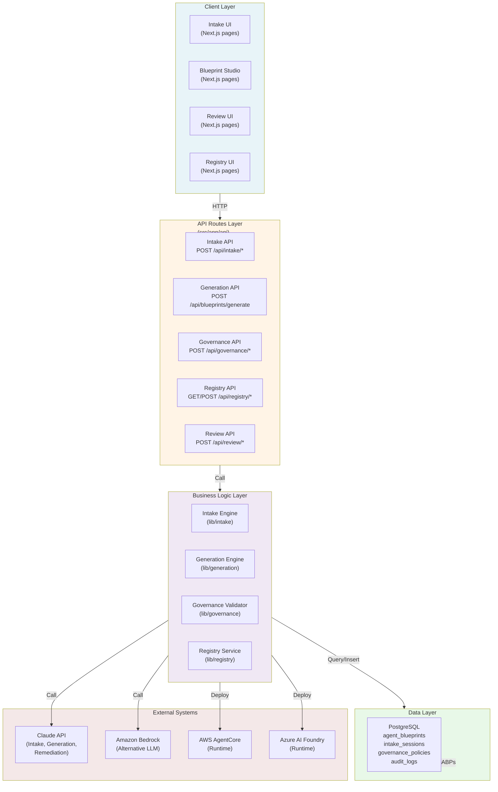

# System Architecture

> **TL;DR:** Intellios is built on Next.js 16 and PostgreSQL, organized around five subsystems: Design Studio (Intake + Generation), Control Plane (Governance + Registry + Review), and Runtime Layer (adapters). All subsystems communicate via server-side API routes and PostgreSQL. The ABP is stored as JSONB in agent_blueprints; governance policies are stored in governance_policies. Streaming is used for AI interactions; structured generation via Zod for validation.

## System Boundary Diagram



## Subsystem Architecture

### Design Studio Subsystem

The Design Studio is responsible for creating agents. It comprises two components:

#### 1. Intake Engine (`src/lib/intake/`)

**Purpose:** Capture enterprise requirements for agent design through a structured, multi-phase process.

**Key Files:**
- `system-prompt.ts` — Claude system prompt defining intake personality and conversation patterns
- `tools.ts` — 11 Claude tools for capturing intake data (context form, capability collection, constraint collection, stakeholder input, policy discovery, risk assessment, integration mapping, deployment profile, testing strategy, maintenance plan, compliance checklist)
- `handlers.ts` — Tool response handlers that build the `intake_payload` progressively
- `session-manager.ts` — Resumable session state management

**Three-Phase Flow:**

1. **Phase 1 — Context Form** (UI-driven)
   - Deployment type (internal, customer-facing, partner-facing)
   - Data sensitivity classification (public, internal, confidential, restricted)
   - Applicable regulations (GDPR, HIPAA, SOX, PCI-DSS, etc.)
   - Primary integrations (Salesforce, SAP, etc.)
   - Stored as intake_sessions.phase_1_data (JSONB)

2. **Phase 2 — Conversational Intake** (Claude-driven)
   - Claude engages in adaptive conversation using `streamText`
   - Adaptive model selection: Claude Sonnet for complex multi-turn reasoning, Claude Haiku for simple clarifications
   - Supports 7 parallel stakeholder lanes: compliance, risk, legal, security, IT, operations, business
   - Enterprises can invite stakeholders to contribute; system synthesizes input
   - Tools progressively build intake_payload
   - Stored as intake_sessions.phase_2_conversation (JSONB array of turns)

3. **Phase 3 — Review** (UI-driven)
   - User reviews captured requirements
   - Confirms or edits structured intake_payload
   - Approved intake_payload ready for Generation Engine

**Data Structure (intake_payload):**
```typescript
{
  id: string                    // UUID
  enterprise_id: string         // Multi-tenancy placeholder
  deployment_type: string       // internal | customer-facing | partner-facing
  data_sensitivity: string      // public | internal | confidential | restricted
  regulations: string[]         // GDPR, HIPAA, SOX, PCI-DSS, etc.
  description: string           // Agent purpose and value prop
  capabilities: Capability[]    // What the agent can do
  constraints: Constraint[]     // What the agent cannot do
  integrations: Integration[]   // External systems to connect
  stakeholder_input: Map<string, any>  // By stakeholder lane
  risk_assessment: any          // Risk profile
  testing_strategy: any         // How to validate agent
  maintenance_plan: any         // Ongoing support model
}
```

**API Route:**
- `POST /api/intake/start` — Create new intake session
- `POST /api/intake/{sessionId}/message` — Send user message, stream Claude response
- `POST /api/intake/{sessionId}/complete` — Complete intake, return intake_payload

#### 2. Generation Engine (`src/lib/generation/`)

**Purpose:** Consume intake payloads and produce Agent Blueprint Packages using Claude's structured generation.

**Key Files:**
- `abp-schema.ts` — Zod schema for ABP structure (validates all generated ABPs)
- `generator.ts` — Main generation logic using `generateObject`
- `refiner.ts` — Support for iterative refinement based on user feedback
- `validator.ts` — Ensures generated ABP conforms to schema

**Generation Process:**

1. Load intake_payload
2. Craft system prompt that translates intake to ABP structure
3. Call Claude.generateObject with Zod schema
4. Claude generates validated JSON ABP
5. Store in agent_blueprints table (status: draft)
6. Return ABP to Blueprint Studio

**Iterative Refinement:**
- User can request changes in natural language ("Make the agent more cautious about modifying data")
- System adds constraints to system prompt
- Re-runs generation
- New ABP version created (v1.0.1, v1.0.2, etc.)

**API Route:**
- `POST /api/blueprints/generate` — Generate ABP from intake_payload, return ABP
- `POST /api/blueprints/{blueprintId}/refine` — Re-generate with updated constraints

#### 3. Blueprint Studio UI (`src/app/blueprints/`)

**Components:**
- Blueprint viewer showing all ABP fields in structured form
- Edit mode for direct field modification
- Real-time validation indicator
- "Submit for Review" action

**Workflow:**
1. Display generated ABP
2. Designer reviews structure
3. Designer optionally edits fields
4. System re-validates on edit
5. Designer clicks "Submit for Review"
6. ABP transitions to in_review status
7. ABP passed to Control Plane

---

### Control Plane Subsystem

The Control Plane is responsible for governing agents. It comprises three components:

#### 1. Governance Validator (`src/lib/governance/`)

**Purpose:** Automatically evaluate ABPs against enterprise governance policies using deterministic rule expressions.

**Key Files:**
- `evaluator.ts` — Policy rule expression evaluator (11 operators)
- `remediator.ts` — Claude-based suggestion generator for violations
- `validator.ts` — Main validator orchestrator
- `expression-language.ts` — 11-operator DSL parser and executor

**Policy Expression Language (11 Operators):**

| Operator | Signature | Example |
|----------|-----------|---------|
| `exists` | `exists(path)` | `exists(abp.capabilities[].integrations)` |
| `not_exists` | `not_exists(path)` | `not_exists(abp.constraints.data_types.pii)` |
| `equals` | `equals(path, value)` | `equals(abp.deployment_type, "internal")` |
| `not_equals` | `not_equals(path, value)` | `not_equals(abp.data_sensitivity, "public")` |
| `contains` | `contains(path, substring)` | `contains(abp.description, "customer data")` |
| `not_contains` | `not_contains(path, substring)` | `not_contains(abp.capabilities[].name, "delete")` |
| `matches` | `matches(path, regex)` | `matches(abp.identity.name, "^[A-Z][a-z]+")` |
| `count_gte` | `count_gte(path, n)` | `count_gte(abp.capabilities, 3)` |
| `count_lte` | `count_lte(path, n)` | `count_lte(abp.constraints, 5)` |
| `includes_type` | `includes_type(path, type)` | `includes_type(abp.integrations[].type, "database")` |
| `not_includes_type` | `not_includes_type(path, type)` | `not_includes_type(abp.capabilities[].type, "deletion")` |

**Evaluation Process:**

1. Load ABP from registry
2. Load all active governance_policies from database
3. For each policy:
   - Parse policy.rules (array of expressions)
   - Evaluate each rule expression against ABP
   - If rule evaluates to false, record violation
4. Generate Validation Report:
   ```typescript
   {
     valid: boolean
     violations: Array<{
       policyId: string
       policyName: string
       ruleIndex: number
       severity: "error" | "warning"
       fieldPath: string
       message: string
       remediationSuggestion: string  // Claude-generated
     }>
     policyCount: number
     evaluationTime: number
     generatedAt: ISO8601
   }
   ```
5. Store report in agent_blueprints.validation_report (JSONB)
6. If errors exist, generate remediation suggestions using Claude
7. Prevent ABP from advancing if error-severity violations exist

**Deterministic Evaluation:**
- No machine learning, no probabilistic outcomes
- Same ABP + same policies = same evaluation result
- Every policy evaluation can be explained and reproduced

**API Route:**
- `POST /api/governance/validate` — Validate ABP against policies, return Validation Report
- `GET /api/governance/policies` — List active policies
- `POST /api/governance/policies` — Create new policy

#### 2. Agent Registry (`src/lib/registry/`)

**Purpose:** Store and manage immutable, versioned ABPs. Central repository for enterprise agent inventory.

**Key Files:**
- `storage.ts` — PostgreSQL query layer
- `versioning.ts` — Semantic versioning logic
- `search.ts` — Full-text and faceted search
- `migration.ts` — Schema migration on read

**PostgreSQL Table: agent_blueprints**

```sql
CREATE TABLE agent_blueprints (
  id                   UUID PRIMARY KEY,
  enterprise_id        UUID NOT NULL,           -- Multi-tenancy
  name                 VARCHAR(256) NOT NULL,
  version              VARCHAR(10) NOT NULL,    -- semantic: major.minor.patch
  status               VARCHAR(50) NOT NULL,    -- draft, in_review, approved, deployed, deprecated
  blueprint_json       JSONB NOT NULL,          -- Full ABP JSON
  validation_report    JSONB,                   -- Latest Validation Report
  metadata             JSONB,                   -- Tags, owner, created_by, etc.
  created_at           TIMESTAMP NOT NULL,
  updated_at           TIMESTAMP NOT NULL,
  created_by           UUID NOT NULL,           -- User ID
  approved_by          UUID,                    -- Reviewer ID
  approval_timestamp   TIMESTAMP,
  deployment_record    JSONB,                   -- Deployment history
  audit_trail          JSONB[],                 -- Event log
  UNIQUE (enterprise_id, name, version)
);
```

**Semantic Versioning:**
- **Patch (v1.0.1)** — Bug fixes, constraint clarifications, non-breaking capability refinements
- **Minor (v1.1.0)** — New capabilities, new integrations, non-breaking constraint additions
- **Major (v2.0.0)** — Breaking changes, capability removal, deployment type changes

**Versioning Workflow:**

1. ABP generated → version 1.0.0 (draft)
2. User requests refinement → version 1.0.1 (regenerated, re-validated)
3. User approves → version 1.0.1 (in_review, then approved)
4. User deploys → version 1.0.1 (deployed)
5. User adds new capability → version 1.1.0 (draft, re-validated)
6. Compliance finds issue → version 1.1.0 is deprecated, v1.1.1-hotfix created
7. Old versions retained permanently in database (audit trail)

**Migrate-on-Read:**
- When reading an old ABP, forward-compatible migrations are applied automatically
- No in-place schema upgrades
- ABPs can be restored to any historical version for audit purposes

**Registry APIs:**
- `GET /api/registry/{blueprintId}` — Fetch ABP by ID
- `GET /api/registry/{blueprintId}/versions` — List all versions
- `GET /api/registry/{blueprintId}/version/{version}` — Fetch specific version
- `GET /api/registry/search?tag=X&owner=Y&status=Z` — Search by tag, owner, status
- `POST /api/registry/{blueprintId}/deploy` — Mark as deployed
- `POST /api/registry/{blueprintId}/deprecate` — Mark as deprecated

#### 3. Blueprint Review UI (`src/app/review/`)

**Purpose:** Human interface for reviewing generated ABPs before approval.

**Components:**
- `ReviewPanel.tsx` — Main review interface
- `ValidationReportViewer.tsx` — Display violations and remediation suggestions
- `ABPViewer.tsx` — Structured ABP display (6 blocks)
- `ApprovalWorkflow.tsx` — Approve/reject/request-changes controls

**ABP Display (6 Blocks):**

1. **Metadata Block**
   - ID, version, creation date, creator name
   - Tags, ownership, deployment target

2. **Identity Block**
   - Agent name, description, icon/avatar
   - Display name, aliases
   - Purpose statement

3. **Capabilities Block**
   - List of capabilities (name, description, input/output schema)
   - Integration connections
   - Tool bindings

4. **Constraints Block**
   - List of constraints (what agent cannot do)
   - Data access restrictions
   - Approval requirements
   - Rate limits, quotas

5. **Governance Block**
   - Applicable policies
   - Audit requirements
   - Compliance certifications
   - Change control settings

6. **Ownership Block**
   - Owner identity, contact info
   - Support team, escalation path
   - Approval chain (signatures, timestamps)

**Validation Report Display:**
- Violations list (error/warning severity)
- Field paths highlighting which ABP field caused violation
- Remediation suggestions from Claude
- Link to policy definition

**Approval Workflow:**
- Reviewer sees all 6 ABP blocks + Validation Report
- Reviewer selects action: approve, reject, or request-changes
- Optional: reviewer adds comments
- System records reviewer identity and timestamp
- ABP status transitions:
  - Approve: in_review → approved
  - Reject: in_review → rejected
  - Request changes: in_review → draft (back to designer)

**API Routes:**
- `GET /api/review/queue` — List ABPs awaiting review
- `GET /api/review/{blueprintId}` — Fetch ABP for review
- `POST /api/review/{blueprintId}/approve` — Approve ABP
- `POST /api/review/{blueprintId}/reject` — Reject ABP
- `POST /api/review/{blueprintId}/request-changes` — Return to designer

---

### Runtime Layer

#### Runtime Adapter Pattern

**Purpose:** Translate approved ABPs into platform-specific configurations and deploy agents.

**Adapter Interface (language-agnostic):**

```typescript
interface RuntimeAdapter {
  // 1. Translate ABP to platform config
  translate(abp: ABP, deploymentProfile: DeploymentProfile): Promise<PlatformConfig>

  // 2. Deploy agent to cloud runtime
  deploy(platformConfig: PlatformConfig): Promise<DeploymentRecord>

  // 3. Monitor agent health and metrics
  monitor(deploymentId: string): Promise<HealthStatus>

  // 4. Teardown/undeploy agent
  teardown(deploymentId: string): Promise<void>

  // 5. Handle incoming webhooks from runtime
  handleWebhook(event: RuntimeEvent): Promise<void>
}
```

**Adapter Implementations:**

1. **AWS AgentCore Adapter** (`src/lib/adapters/aws-agentcore.ts`)
   - Translates ABP to CloudFormation templates
   - Lambda function deployment
   - IAM policy generation
   - API Gateway endpoint setup
   - CloudWatch logging configuration
   - Respects audit policies in ABP

2. **Azure AI Foundry Adapter** (`src/lib/adapters/azure-ai-foundry.ts`)
   - Translates ABP to ARM templates
   - Azure AI Foundry project configuration
   - Managed identity setup
   - Application Insights logging

3. **On-Premise Adapter** (Future)
   - Deploy to self-managed Kubernetes
   - Docker container image generation
   - Helm chart creation

**Webhook Bridge:**
- RuntimeAdapters register webhooks with cloud runtimes
- Cloud runtimes send events (agent created, error, timeout, quota exceeded)
- Webhooks flow back to `/api/webhooks/runtime` route
- Events are logged in deployment_record for audit

---

## Technology Stack

### Web Framework & API Routes

| Component | Technology | Purpose |
|-----------|-----------|---------|
| **Server** | Next.js 16 (App Router) | Server-side rendering, API routes, streaming support |
| **API Routes** | `src/app/api/` | RESTful endpoints for all subsystems |
| **Streaming** | Vercel AI SDK v5 | `streamText` for real-time Claude responses in Intake Engine |
| **Structured Generation** | Vercel AI SDK v5 + Zod | `generateObject` for ABP generation with schema validation |

### Database

| Component | Technology | Purpose |
|-----------|-----------|---------|
| **Database** | PostgreSQL 14+ | Persistent storage, ACID compliance, JSONB support |
| **ORM** | Drizzle ORM | Type-safe schema management, migrations, queries |
| **Migrations** | Drizzle migrations | Schema versioning and deployment |

**Core Tables:**

```typescript
// src/lib/db/schema.ts

export const agent_blueprints = pgTable('agent_blueprints', {
  id: uuid('id').primaryKey(),
  enterprise_id: uuid('enterprise_id').notNull(),
  name: varchar('name', { length: 256 }).notNull(),
  version: varchar('version', { length: 10 }).notNull(),
  status: varchar('status', { length: 50 }).notNull(),
  blueprint_json: jsonb('blueprint_json').notNull(),
  validation_report: jsonb('validation_report'),
  metadata: jsonb('metadata'),
  created_at: timestamp('created_at').notNull(),
  updated_at: timestamp('updated_at').notNull(),
  created_by: uuid('created_by').notNull(),
  approved_by: uuid('approved_by'),
  approval_timestamp: timestamp('approval_timestamp'),
  deployment_record: jsonb('deployment_record'),
  audit_trail: jsonb('audit_trail').array(),
});

export const intake_sessions = pgTable('intake_sessions', {
  id: uuid('id').primaryKey(),
  enterprise_id: uuid('enterprise_id').notNull(),
  status: varchar('status', { length: 50 }).notNull(),
  phase_1_data: jsonb('phase_1_data'),
  phase_2_conversation: jsonb('phase_2_conversation'),
  intake_payload: jsonb('intake_payload'),
  created_at: timestamp('created_at').notNull(),
  updated_at: timestamp('updated_at').notNull(),
  created_by: uuid('created_by').notNull(),
});

export const governance_policies = pgTable('governance_policies', {
  id: uuid('id').primaryKey(),
  enterprise_id: uuid('enterprise_id').notNull(),
  name: varchar('name', { length: 256 }).notNull(),
  version: varchar('version', { length: 10 }).notNull(),
  enabled: boolean('enabled').default(true),
  rules: jsonb('rules').notNull(),
  severity: varchar('severity', { length: 50 }).notNull(),
  description: text('description'),
  created_at: timestamp('created_at').notNull(),
  updated_by: uuid('updated_by').notNull(),
});

export const audit_logs = pgTable('audit_logs', {
  id: uuid('id').primaryKey(),
  enterprise_id: uuid('enterprise_id').notNull(),
  event_type: varchar('event_type', { length: 100 }).notNull(),
  resource_type: varchar('resource_type', { length: 100 }).notNull(),
  resource_id: uuid('resource_id').notNull(),
  actor_id: uuid('actor_id').notNull(),
  action: text('action').notNull(),
  details: jsonb('details'),
  timestamp: timestamp('timestamp').notNull(),
});
```

### UI Components

| Layer | Technology | Purpose |
|-------|-----------|---------|
| **Component Library** | Catalyst Kit (27 components) | Production-grade UI built on Headless UI + Tailwind |
| **Styling** | Tailwind CSS | Utility-first, responsive design |
| **Routing** | Next.js Link | Client-side navigation with `next/link` |

**Catalyst Components Used:**
- `Button`, `Badge` — CTA and status indicators
- `Table`, `TableHead`, `TableBody`, `TableRow`, `TableCell` — Data display
- `Dialog`, `DialogTitle`, `DialogBody`, `DialogActions` — Modals
- `Dropdown`, `DropdownMenu`, `DropdownItem` — Menus
- `Input`, `Textarea`, `Select` — Form controls
- `Sidebar`, `SidebarLayout` — Navigation
- `Alert`, `Text`, `Heading` — Content

### AI Integration

| Component | Provider | Purpose |
|-----------|----------|---------|
| **LLM API** | Anthropic Claude (API) or Amazon Bedrock | Intake interviews, ABP generation, remediation suggestions |
| **Model Selection** | Adaptive (Sonnet/Haiku) | Sonnet for complex reasoning, Haiku for simple clarifications |
| **Streaming** | Vercel AI SDK v5 `streamText` | Real-time Claude responses in intake UI |
| **Structured Generation** | Vercel AI SDK v5 `generateObject` + Zod | ABP generation with schema validation |

---

## Communication Patterns

### Server-Side Only

All inter-subsystem communication is **server-side** via API routes. No browser-to-browser direct communication.

**Pattern:**
```
Client UI → HTTP → API Route → Business Logic → PostgreSQL
Client UI → HTTP → API Route → Claude API
Client UI → HTTP → API Route → Runtime Adapter → AWS/Azure
```

### Streaming (Intake Engine)

**Pattern:** Client sends message → API route streams Claude response in real-time

```typescript
// src/app/api/intake/[sessionId]/message/route.ts
export async function POST(req) {
  const { message } = await req.json()

  const stream = await streamText({
    model: selectModel(complexity),  // Sonnet or Haiku
    messages: [...previousTurns, { role: 'user', content: message }],
    tools: intakeTools,
  })

  return stream.toDataStreamResponse()
}
```

### Structured Generation (Generation Engine)

**Pattern:** System prompt + intake payload → Claude generates validated ABP

```typescript
// src/lib/generation/generator.ts
export async function generateABP(intakePayload: IntakePayload) {
  const { object: abp } = await generateObject({
    model: claude3Sonnet,
    schema: abpSchema,  // Zod schema
    system: generateSystemPrompt(intakePayload),
    prompt: `Generate ABP for: ${intakePayload.description}`
  })

  return abp  // Validated ABP
}
```

### Deterministic Evaluation (Governance Validator)

**Pattern:** ABP + policy rules → deterministic evaluation (no LLM)

```typescript
// src/lib/governance/evaluator.ts
export function evaluatePolicy(abp: ABP, policy: Policy): PolicyEvaluation {
  const violations = []
  for (const rule of policy.rules) {
    const result = evaluateExpression(rule, abp)
    if (!result.success) {
      violations.push({
        ruleIndex: rule.index,
        severity: rule.severity,
        message: result.error,
      })
    }
  }
  return { violations, valid: violations.length === 0 }
}
```

---

## Security Boundaries

### Authentication & Authorization (Multi-Tenancy)

**Current Status:** Placeholder implementation (pre-MVP enterprise features)

- `enterprise_id` column present in all tables
- Expected: OAuth 2.0 / OIDC integration
- Expected: Role-based access control (RBAC): admin, designer, reviewer, compliance officer
- Expected: Token-based API authentication for runtime adapters

**Placeholder:**
```typescript
// src/lib/auth/context.ts
export async function getEnterpriseContext() {
  // TODO: Replace with real auth
  return {
    enterprise_id: 'placeholder-enterprise-uuid',
    user_id: 'placeholder-user-uuid',
    roles: ['admin'],  // TODO: Fetch from auth provider
  }
}
```

### Data Isolation

- All queries filter by `enterprise_id` (multi-tenant isolation)
- ABPs, policies, audit logs isolated by enterprise
- No cross-enterprise data leakage

### Audit Trail

- Every significant action logged in `audit_logs` table
- Fields: actor_id, action, resource_type, resource_id, timestamp, details
- Immutable: audit logs never deleted
- Queryable for compliance: "Show all ABP approvals by Compliance Officer Carol in Q1"

---

## Scalability Considerations

### Stateless API Layer

- All API routes are stateless
- Horizontal scaling: add more Next.js instances behind load balancer
- No in-memory state, no sticky sessions
- Session state stored in PostgreSQL (resumable intake sessions)

### Database as Single Source of Truth

- PostgreSQL is the only persistent store
- All subsystems query PostgreSQL for current state
- No divergence between subsystem caches
- Backups and disaster recovery centered on PostgreSQL

### Async Operations (Future)

- Generation and validation currently synchronous
- Future: Message queue (RabbitMQ, SQS) for long-running tasks
- Webhooks for runtime events (agent created, error, etc.)

### JSONB for Flexible Schema

- ABP stored as JSONB in PostgreSQL
- Allows schema evolution without migrations
- Queries can access nested fields: `blueprint_json->'capabilities'`
- Indexes on frequently-queried paths

---

## Subsystem Interaction Summary

| From | To | Via | Data |
|------|----|----|------|
| Intake Engine | Generation Engine | API route | intake_payload |
| Generation Engine | Agent Registry | SQL insert | ABP (draft) |
| Agent Registry | Governance Validator | API route | ABP |
| Governance Validator | Agent Registry | SQL update | validation_report |
| Governance Validator | Claude (remediation) | Claude API | ABP + violation |
| Agent Registry | Blueprint Review UI | API route | ABP + validation_report |
| Blueprint Review UI | Agent Registry | SQL update | status transition + reviewer info |
| Agent Registry | Runtime Adapter | API route | ABP (approved) |
| Runtime Adapter | Claude API | Claude API | ABP (for translation hints) |
| Runtime Adapter | AWS/Azure | Cloud SDK | platform-specific config |
| Cloud Runtime | Intellios | Webhook | deployment events |

---

## Summary

Intellios is built on a modern, scalable stack: Next.js 16 for the web layer, PostgreSQL with Drizzle for data persistence, Vercel AI SDK v5 for Claude integration, and Catalyst for UI components. Five subsystems (Intake, Generation, Governance, Registry, Review) operate on the central ABP artifact via server-side API routes. Communication is synchronous for intake and generation, deterministic for governance, and event-driven for runtime webhooks. The architecture prioritizes auditability, multi-tenancy, and horizontal scalability.

---

*See also: [Data Flow](data-flow.md), [Database Schema](database-schema.md), [API References](api-references.md)*

*Next: [Data Flow](data-flow.md), [Runtime Adapter Pattern](runtime-adapter-pattern.md)*
