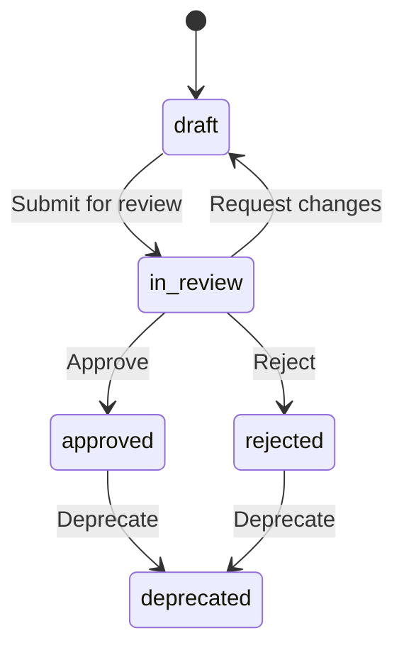

# Intellios Knowledge Base — Architecture Document

---

## 1. Purpose & Scope

This document defines the structural architecture of the Intellios Knowledge Base (KB). It establishes the taxonomy, naming conventions, metadata schema, content type definitions, and cross-referencing strategy that govern every article in the KB.

The KB serves as the canonical external-facing documentation for Intellios — the governed control plane for enterprise AI agents. It complements (but does not replace) the internal engineering documentation maintained in `docs/` within the Intellios repository.

### Audience Segmentation

Every article in the KB targets one or more of four primary audiences:

| Audience Tag | Label | Description |
|---|---|---|
| `executive` | Executive / C-Suite | Strategic value, ROI, competitive differentiation, risk reduction |
| `compliance` | Compliance & Risk | Regulatory alignment (SR 11-7, OCC, EU AI Act), audit readiness, evidence generation |
| `engineering` | Platform Engineers / DevOps | Architecture, deployment, integration patterns, infrastructure |
| `product` | Product Managers / Business Analysts | Capabilities, use cases, roadmap context, competitive positioning |

Articles may carry multiple audience tags. The primary audience determines the article's depth, terminology level, and assumed prerequisites.

---

## 2. Taxonomy — Hierarchical Structure

The KB is organized into twelve top-level sections. Each section contains articles organized by content type (concept, task, reference, troubleshooting, or decision guide). Subsections group related articles within a section.

```
kb/
├── KB-ARCHITECTURE.md              ← This document
├── SITE-MAP.md                     ← Master table of contents
├── _meta/
│   ├── metadata-schema.md          ← Article metadata specification
│   ├── naming-conventions.md       ← File and ID naming rules
│   ├── content-types.md            ← Content type definitions
│   ├── style-guide.md              ← Voice, tone, formatting standards
│   └── templates/
│       ├── concept.md              ← Template: concept article
│       ├── task.md                 ← Template: task/how-to article
│       ├── reference.md            ← Template: reference article
│       ├── troubleshooting.md      ← Template: troubleshooting article
│       └── decision-guide.md       ← Template: decision guide article
│
├── 01-platform-overview/
│   ├── _index.md                   ← Section landing page
│   ├── what-is-intellios.md
│   ├── value-proposition.md
│   ├── architecture-overview.md
│   ├── key-capabilities.md
│   └── how-intellios-differs.md
│
├── 02-getting-started/
│   ├── _index.md
│   ├── executive-quick-start.md
│   ├── compliance-onboarding.md
│   ├── engineer-setup-guide.md
│   └── pm-orientation.md
│
├── 03-core-concepts/
│   ├── _index.md
│   ├── agent-blueprint-package.md
│   ├── governance-as-code.md
│   ├── policy-engine.md
│   ├── policy-expression-language.md
│   ├── agent-lifecycle-states.md
│   ├── runtime-adapters.md
│   ├── compliance-evidence-chain.md
│   ├── design-studio.md
│   ├── control-plane.md
│   └── stakeholder-contributions.md
│
├── 04-architecture-integration/
│   ├── _index.md
│   ├── system-architecture.md
│   ├── data-flow.md
│   ├── runtime-adapter-pattern.md
│   ├── agentcore-integration.md
│   ├── ai-foundry-integration.md
│   ├── api-reference/
│   │   ├── _index.md
│   │   ├── intake-api.md
│   │   ├── blueprints-api.md
│   │   ├── registry-api.md
│   │   ├── governance-api.md
│   │   └── review-api.md
│   ├── webhook-integration.md
│   ├── database-schema.md
│   └── deployment-guide.md
│
├── 05-governance-compliance/
│   ├── _index.md
│   ├── sr-11-7-mapping.md
│   ├── occ-guidelines-alignment.md
│   ├── eu-ai-act-readiness.md
│   ├── mrm-documentation-automation.md
│   ├── model-inventory-management.md
│   ├── drift-detection.md
│   ├── shadow-ai-prevention.md
│   ├── audit-trail-generation.md
│   ├── compliance-evidence-workflows.md
│   └── policy-authoring-guide.md
│
├── 06-use-cases-playbooks/
│   ├── _index.md
│   ├── financial-services-scenarios.md
│   ├── insurance-scenarios.md
│   ├── healthcare-scenarios.md
│   ├── shadow-ai-remediation-playbook.md
│   ├── agent-onboarding-playbook.md
│   ├── incident-response-model-drift.md
│   ├── express-lane-templates.md
│   └── stakeholder-intake-playbook.md
│
├── 07-administration-operations/
│   ├── _index.md
│   ├── rbac-configuration.md
│   ├── policy-management.md
│   ├── observability-dashboards.md
│   ├── alerting-configuration.md
│   ├── agent-fleet-management.md
│   ├── multi-tenancy.md
│   └── backup-recovery.md
│
├── 08-security-trust/
│   ├── _index.md
│   ├── data-handling-encryption.md
│   ├── soc2-readiness.md
│   ├── fedramp-readiness.md
│   ├── tenant-isolation.md
│   ├── secret-management.md
│   └── penetration-testing-program.md
│
├── 09-roi-business-case/
│   ├── _index.md
│   ├── three-pillar-roi-framework.md
│   ├── tco-comparison.md
│   ├── regulatory-penalty-avoidance.md
│   ├── mrm-cost-reduction.md
│   ├── governed-deployment-velocity.md
│   └── customer-case-studies.md
│
├── 10-faq-troubleshooting/
│   ├── _index.md
│   ├── executive-faq.md
│   ├── compliance-faq.md
│   ├── engineering-faq.md
│   ├── product-faq.md
│   ├── known-issues.md
│   └── escalation-paths.md
│
├── 11-glossary/
│   ├── _index.md
│   └── terms.md
│
└── 12-release-notes/
    ├── _index.md
    ├── changelog.md
    ├── upcoming-features.md
    └── deprecation-notices.md
```

### Section Descriptions

| # | Section | Purpose | Primary Audiences |
|---|---|---|---|
| 01 | Platform Overview | What Intellios is, why it exists, how it differs | `executive`, `product` |
| 02 | Getting Started | Audience-specific onboarding paths | All |
| 03 | Core Concepts | Foundational mental models and terminology | All |
| 04 | Architecture & Integration | Technical depth: system design, APIs, deployment | `engineering` |
| 05 | Governance & Compliance | Regulatory mapping, audit workflows, policy authoring | `compliance`, `engineering` |
| 06 | Use Cases & Playbooks | Actionable scenarios by industry and workflow | `product`, `compliance` |
| 07 | Administration & Operations | Day-to-day platform management | `engineering`, `compliance` |
| 08 | Security & Trust | Security posture, certifications, isolation | `engineering`, `compliance`, `executive` |
| 09 | ROI & Business Case | Quantified value, TCO, benchmarks | `executive`, `product` |
| 10 | FAQ & Troubleshooting | Common questions, known issues, escalation | All |
| 11 | Glossary | Canonical term definitions | All |
| 12 | Release Notes | Changelog, roadmap, deprecations | `engineering`, `product` |

---

## 3. Naming Conventions

### File Names

All article files use **kebab-case** with the following pattern:

```
{descriptive-slug}.md
```

Rules:
- Lowercase only, hyphens as separators (no underscores, no spaces)
- Maximum 60 characters
- Descriptive and search-friendly (e.g., `sr-11-7-mapping.md` not `compliance-doc-1.md`)
- Section landing pages are always `_index.md`
- API reference files use the pattern `{resource}-api.md`

### Article IDs

Every article has a unique ID in its frontmatter, constructed as:

```
{section-number}-{sequential-number}
```

Example: `05-003` = Governance & Compliance section, third article.

IDs are stable — they never change once assigned, even if an article moves or is renamed.

### Section Numbering

Sections are zero-padded two-digit numbers (`01` through `12`). This ensures correct sort order in file systems and documentation platforms.

---

## 4. Metadata Schema

Every article begins with YAML frontmatter conforming to this schema:

```yaml
---
id: "03-004"                              # Unique, stable article identifier
title: "Policy Expression Language"       # Human-readable title (max 80 chars)
slug: "policy-expression-language"        # URL-friendly slug (matches filename)
type: "concept"                           # One of: concept | task | reference | troubleshooting | decision-guide
audiences:                                # One or more audience tags
  - compliance
  - engineering
status: "published"                       # One of: draft | in-review | published | deprecated
version: "1.0.0"                          # Semantic version, tied to platform release
platform_version: "1.2.0"                 # Intellios platform version this applies to
created: "2026-04-05"                     # ISO 8601 date
updated: "2026-04-05"                     # ISO 8601 date of last substantive edit
author: "Documentation Team"              # Original author or team
reviewers:                                # List of reviewers
  - "Compliance Lead"
  - "Engineering Lead"
tags:                                     # Search keywords and synonyms
  - governance
  - policy rules
  - expression language
  - operators
  - field validation
prerequisites:                            # Article IDs that should be read first
  - "03-001"                              # Agent Blueprint Package
  - "03-002"                              # Governance-as-Code
related:                                  # Article IDs for cross-reference
  - "05-010"                              # Policy Authoring Guide
  - "03-003"                              # Policy Engine
next_steps:                               # Suggested reading after this article
  - "05-010"                              # Policy Authoring Guide
  - "07-002"                              # Policy Management
feedback_url: "https://feedback.intellios.ai/kb"             # Link to feedback form/channel
tldr: >
  Intellios policies use a structured expression language with 11 operators
  (exists, equals, contains, matches, etc.) applied to ABP field paths.
  Rules are deterministic — no LLM inference in evaluation — ensuring
  reproducible, auditable governance decisions.
---
```

### Required Fields

| Field | Type | Required | Description |
|---|---|---|---|
| `id` | string | Yes | Stable unique identifier (`{section}-{seq}`) |
| `title` | string | Yes | Human-readable title, max 80 characters |
| `slug` | string | Yes | URL-friendly identifier, matches filename |
| `type` | enum | Yes | Content type: `concept`, `task`, `reference`, `troubleshooting`, `decision-guide` |
| `audiences` | array | Yes | One or more of: `executive`, `compliance`, `engineering`, `product` |
| `status` | enum | Yes | Lifecycle: `draft`, `in-review`, `published`, `deprecated` |
| `version` | string | Yes | Article version (semver) |
| `platform_version` | string | Yes | Intellios version this content applies to |
| `created` | date | Yes | Creation date (ISO 8601) |
| `updated` | date | Yes | Last substantive update (ISO 8601) |
| `tldr` | string | Yes | 2-3 sentence summary for progressive disclosure |
| `tags` | array | Yes | Search-optimized keywords (minimum 3) |

### Optional Fields

| Field | Type | Description |
|---|---|---|
| `author` | string | Original author or team |
| `reviewers` | array | List of content reviewers |
| `prerequisites` | array | Article IDs to read first |
| `related` | array | Cross-referenced article IDs |
| `next_steps` | array | Suggested follow-on reading |
| `feedback_url` | string | Link to feedback mechanism |
| `deprecated_by` | string | Article ID that supersedes this one (when status = deprecated) |
| `applies_to` | array | Specific components or features (e.g., `["Governance Validator", "Policy Engine"]`) |

---

## 5. Content Types

The KB uses five content types derived from DITA topic-based authoring principles. Each type has a defined structure, purpose, and template.

### 5.1 Concept

**Purpose:** Explain *what* something is and *why* it matters. Builds mental models.

**Structure:**
1. **TL;DR** — auto-rendered from frontmatter `tldr` field
2. **Overview** — 2-3 paragraphs establishing context and significance
3. **How It Works** — Mechanics, with diagrams where applicable
4. **Key Principles** — Numbered design principles or properties
5. **Relationship to Other Concepts** — How this concept connects to the broader system
6. **Examples** — Concrete illustrations
7. **Related Articles** — Auto-rendered from frontmatter

**When to use:** Explaining ABPs, governance-as-code, lifecycle states, runtime adapters, the compliance evidence chain, or any foundational mental model.

### 5.2 Task (How-To)

**Purpose:** Guide the reader through completing a specific action. Outcome-oriented.

**Structure:**
1. **TL;DR** — auto-rendered from frontmatter
2. **Goal** — One sentence: what the reader will accomplish
3. **Prerequisites** — What must be in place before starting
4. **Steps** — Numbered, imperative steps with expected outcomes per step
5. **Verification** — How to confirm the task succeeded
6. **Troubleshooting** — Common failures and resolutions (inline or linked)
7. **Next Steps** — What to do after completing this task
8. **Related Articles** — Auto-rendered from frontmatter

**When to use:** Onboarding guides, integration walkthroughs, policy authoring, deployment procedures.

### 5.3 Reference

**Purpose:** Provide comprehensive, structured lookup information. Not narrative — designed for scanning.

**Structure:**
1. **TL;DR** — auto-rendered from frontmatter
2. **Overview** — Brief context (1 paragraph max)
3. **Reference Content** — Tables, parameter lists, endpoint specifications, schema definitions
4. **Examples** — Code snippets, request/response pairs, configuration samples
5. **Notes & Caveats** — Edge cases, version-specific behavior
6. **Related Articles** — Auto-rendered from frontmatter

**When to use:** API endpoints, schema definitions, operator reference tables, configuration parameter lists, status code tables.

### 5.4 Troubleshooting

**Purpose:** Diagnose and resolve specific problems. Symptom-driven.

**Structure:**
1. **TL;DR** — auto-rendered from frontmatter
2. **Symptom** — What the reader is observing
3. **Possible Causes** — Ordered by likelihood
4. **Diagnosis Steps** — How to identify the root cause
5. **Resolution** — Fix per identified cause
6. **Prevention** — How to avoid recurrence
7. **Escalation** — When and how to escalate if resolution fails
8. **Related Articles** — Auto-rendered from frontmatter

**When to use:** Known issues, common error conditions, validation failures, integration failures.

### 5.5 Decision Guide

**Purpose:** Help readers choose between options when multiple valid paths exist. Structured comparison.

**Structure:**
1. **TL;DR** — auto-rendered from frontmatter
2. **Decision Context** — What decision the reader faces and why it matters
3. **Options** — Each option with description, trade-offs, and best-fit scenarios
4. **Comparison Matrix** — Side-by-side evaluation criteria
5. **Recommendation** — Intellios's recommended default with rationale
6. **Decision Tree** — Visual flowchart for rapid selection (placeholder for diagram)
7. **Related Articles** — Auto-rendered from frontmatter

**When to use:** Runtime adapter selection, policy severity configuration, deployment topology choices, intake mode selection (conversational vs. express-lane).

---

## 6. Cross-Referencing Strategy

### Internal Links

All cross-references use relative paths within the KB:

```markdown
See [Agent Blueprint Package](./03-core-concepts/agent-blueprint-package.md) for the canonical ABP structure.
```

### Link Directionality

Cross-references are bidirectional. When Article A references Article B, Article B's `related` frontmatter should include Article A's ID. A quarterly link audit verifies bidirectional integrity.

### Prerequisite Chains

The `prerequisites` field establishes a directed acyclic graph (DAG) of reading order. No circular dependencies are permitted. The onboarding guides in Section 02 serve as entry points into these chains, tailored per audience.

### External Links

Links to external resources (regulatory documents, cloud provider docs, standards bodies) use the format:

```markdown
[SR 11-7: Guidance on Model Risk Management](https://www.federalreserve.gov/supervisionreg/srletters/sr1107.htm)
```

External links are tagged in a central registry (`_meta/external-links.md`) for periodic validity checks.

---

## 7. Progressive Disclosure Model

Every article supports three levels of depth:

| Level | Mechanism | Reader Experience |
|---|---|---|
| **L1 — Scan** | TL;DR in frontmatter | 2-3 sentence summary, visible in search results and article headers |
| **L2 — Understand** | Overview + How It Works sections | 2-5 minute read, sufficient for cross-functional understanding |
| **L3 — Master** | Full article with examples, edge cases, and reference tables | Complete depth for practitioners |

Section landing pages (`_index.md`) provide L1 summaries of every article in that section, enabling rapid orientation.

---

## 8. Visual Standards

### Diagram Placeholders

Articles requiring diagrams use the following placeholder format:

```markdown
> **[DIAGRAM: {diagram-type} — {description}]**
>
> *Dimensions: {width}x{height} | Format: SVG preferred, PNG fallback*
> *Source file: `_assets/{filename}.{ext}`*
```

### Diagram Types

| Type | Usage | Tool Recommendation |
|---|---|---|
| Architecture diagram | System boundaries, subsystem relationships | Draw.io, Mermaid |
| Sequence diagram | API call flows, multi-step processes | Mermaid |
| State diagram | Lifecycle transitions, workflow states | Mermaid |
| Decision tree | Selection logic, troubleshooting flows | Draw.io |
| Compliance mapping | Regulatory requirement → platform capability | Table + visual overlay |
| Data flow | Information movement between subsystems | Draw.io, Mermaid |

### Mermaid Support

Where the KB platform supports Mermaid rendering, diagrams should be authored inline:

````markdown

````

---

## 9. Search Optimization

### Tag Taxonomy

Tags serve as the primary search optimization mechanism. Every article must include:

- **Domain tags** — The subject area (e.g., `governance`, `compliance`, `deployment`)
- **Feature tags** — Specific platform features (e.g., `policy-engine`, `intake-engine`, `agent-registry`)
- **Regulatory tags** — Applicable frameworks (e.g., `sr-11-7`, `eu-ai-act`, `occ-guidelines`)
- **Synonym tags** — Alternative phrasings readers might search for (e.g., `model risk` alongside `mrm`)

### Search Index Fields

The search index should include: `title`, `tldr`, `tags`, `audiences`, `type`, and the first 500 characters of body content.

---

## 10. Versioning Strategy

### Article Versioning

Articles follow semantic versioning tied to platform releases:

- **Patch** (1.0.x): Typo fixes, formatting, minor clarifications
- **Minor** (1.x.0): New sections, updated examples, additional context
- **Major** (x.0.0): Fundamental restructuring, behavioral changes in the platform

### Platform Version Binding

The `platform_version` field indicates which Intellios release the article was last verified against. When a new platform version ships, a documentation sweep marks articles as either `current` (verified) or `needs-review`.

### Deprecation

Deprecated articles retain their ID and URL but display a prominent banner:

```
⚠️ This article applies to Intellios v{old}. For the current version, see [{new-title}]({new-url}).
```

The `deprecated_by` frontmatter field links to the replacement article.

---

## 11. Feedback Mechanism

Every article footer includes:

1. **"Was this helpful?"** — Thumbs up/down with optional comment
2. **"Report an issue"** — Links to `feedback_url` with pre-populated article ID
3. **Last updated** — Rendered from `updated` frontmatter field
4. **Article version** — Rendered from `version` frontmatter field

Feedback is routed to the KB owner for triage. Articles with negative feedback scores above a threshold (configurable, default: 3 within 30 days) are automatically flagged for review.

---

## 12. Content Lifecycle

```
                    ┌─────────┐
                    │  draft   │
                    └────┬─────┘
                         │ Author submits for review
                         ▼
                    ┌──────────┐
                ┌───│ in-review │───┐
                │   └──────────┘   │
                │                  │
        Revisions needed     Approved
                │                  │
                ▼                  ▼
           ┌─────────┐      ┌───────────┐
           │  draft   │      │ published │
           └─────────┘      └─────┬─────┘
                                  │
                         Platform version ships
                         or content superseded
                                  │
                                  ▼
                           ┌─────────────┐
                           │ deprecated  │
                           └─────────────┘
```

### Review Triggers

- New article creation
- Platform version release (documentation sweep)
- Negative feedback threshold exceeded
- Quarterly freshness audit
- Regulatory framework update (e.g., new OCC guidance)

---

## 13. Platform Compatibility

This KB architecture is designed to be portable across documentation platforms:

| Platform | Compatibility Notes |
|---|---|
| **GitBook** | Native Markdown + YAML frontmatter support. Use `_index.md` as section READMEs. |
| **ReadTheDocs / MkDocs** | Use `mkdocs.yml` nav to mirror taxonomy. Frontmatter parsed by plugins. |
| **Confluence** | Import Markdown via Confluence Cloud API. Metadata maps to page properties. |
| **Notion** | Import Markdown. Audience tags map to database properties. |
| **Docusaurus** | Native Markdown + frontmatter. Sidebar auto-generated from directory structure. |

The YAML frontmatter schema is the single source of truth for metadata regardless of platform.

---

## Appendix A: Article ID Registry

The master article ID registry is maintained in `SITE-MAP.md`. Every new article must be registered there before publication.

## Appendix B: Content Type Decision Matrix

| I need to... | Content Type |
|---|---|
| Explain what something is | **Concept** |
| Walk someone through a procedure | **Task** |
| Provide lookup information (APIs, schemas, parameters) | **Reference** |
| Help someone fix a problem | **Troubleshooting** |
| Help someone choose between options | **Decision Guide** |
